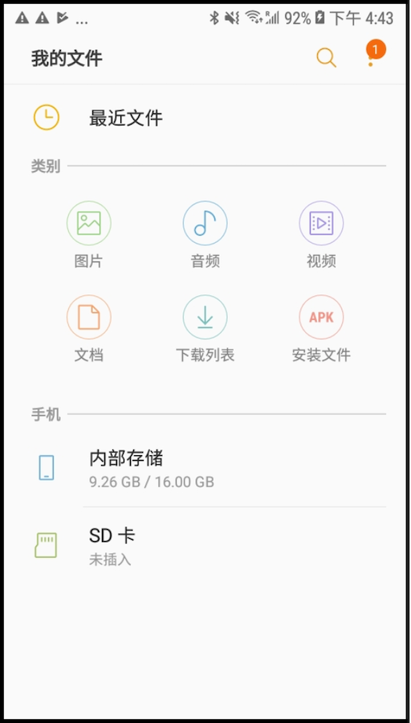
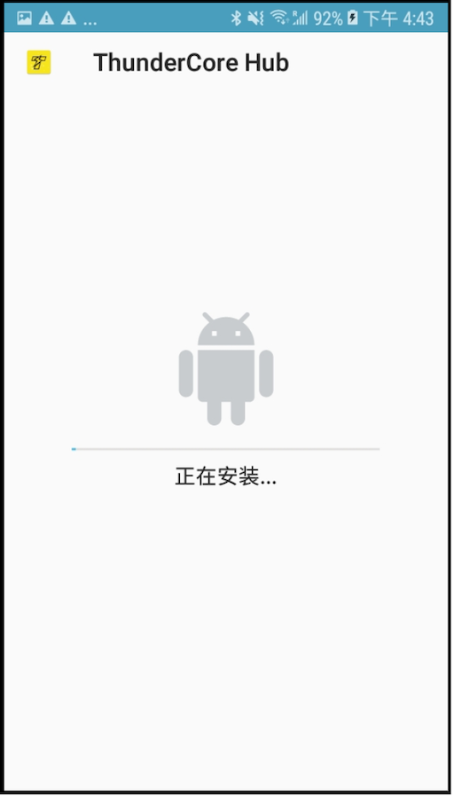
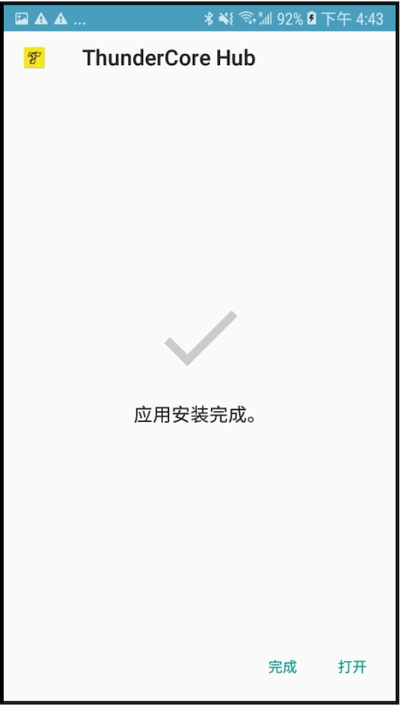

## 介绍
*注意：本教程以三星 Galaxy J2 作为示范，其他安卓手机下载方式略同。*

## 步骤

1. 首先在手机的档案管理中找回已下载好的安装档，之后点撃档案。 

2. 如果您是首次开启这类档案，由于安卓的系统预设是关闭了安装外来的档案以保护手机的安全性，所以会跳出如上图的提示。请点击「安装」以继续。

3. 安装完毕后，屏幕会出现提示，表示该应用已成功安装于手机的系统上，这时按「打开」就可以进入应用。

