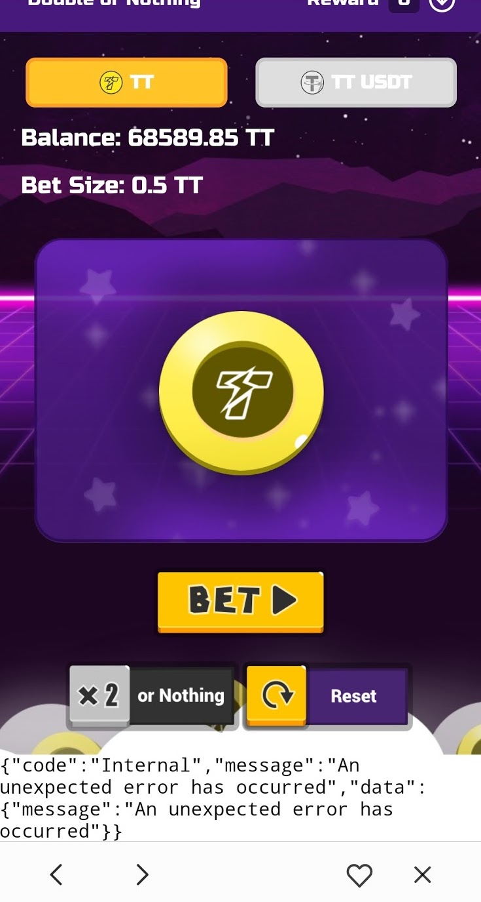

## 除錯技巧：在 DApp 中內建一個顯示錯誤的 Console

在 Hub Wallet Tab 在 DApp 中加入一個顯示「與鏈互動時發生的錯誤」的地方。

範例1: [TT20 轉帳](https://github.com/thundercore/hubbit-field-support/blob/c69d3798f77fd07d8b3f0381b5a0dc78addd0691/src/index.js#L172)

範例 2: [DoubleOrNothing](https://github.com/thundercore/DoubleOrNothing/commit/8d5e755876f77f309937b31791ae246b4826566a#diff-1a2294bec8f8b96cd516ecd00ef9f3c8R135)

