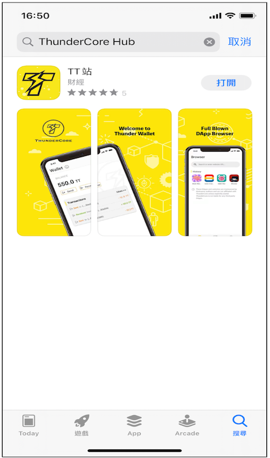
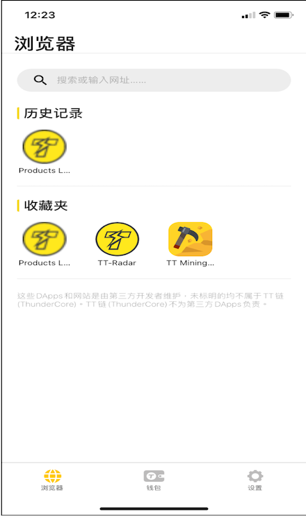
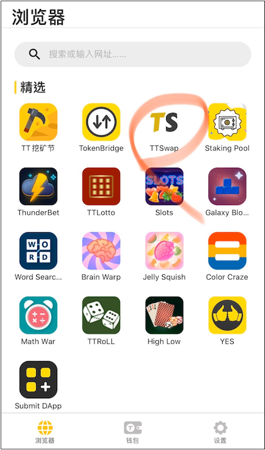
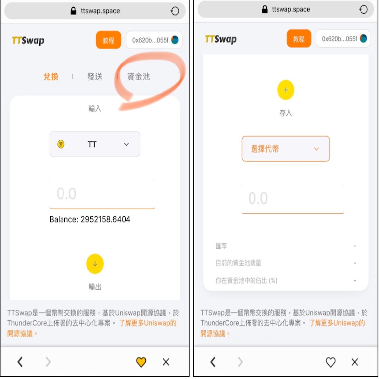
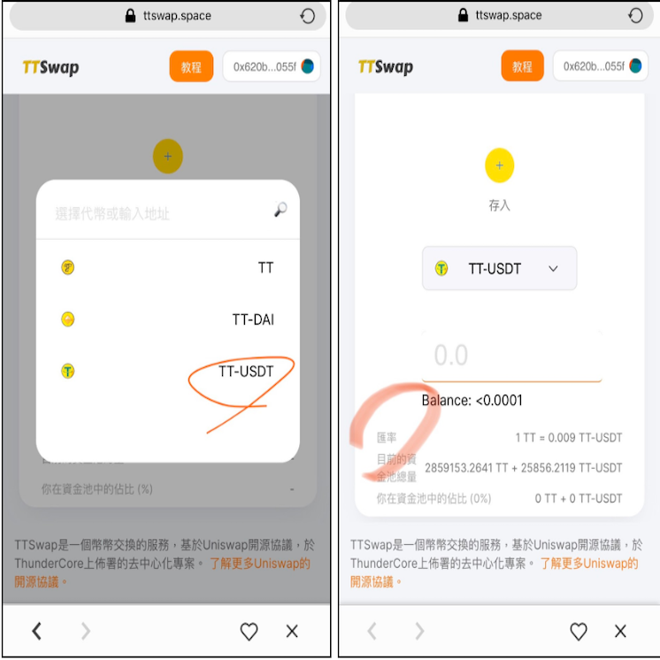
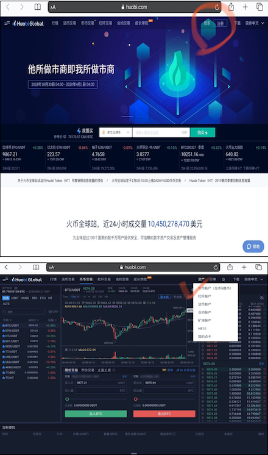
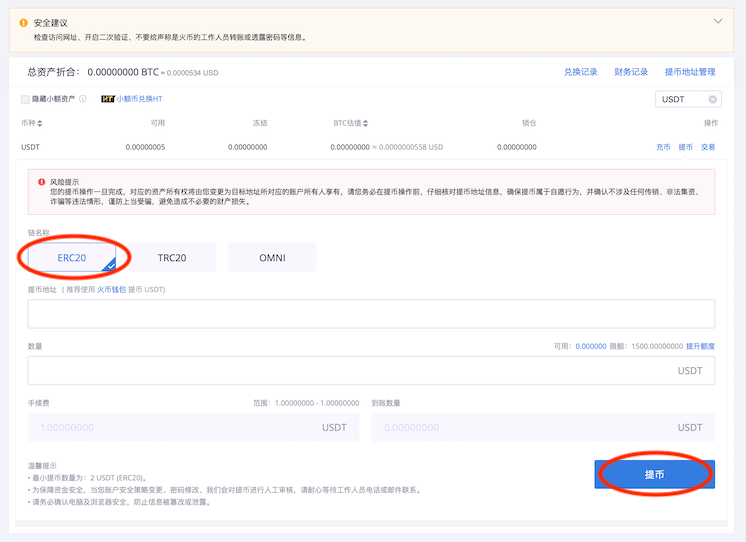
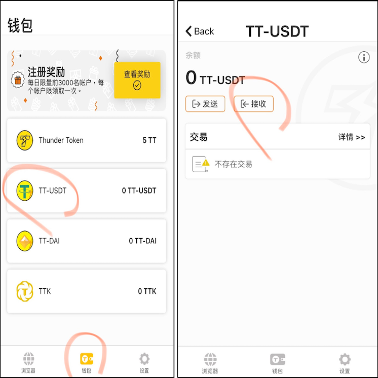
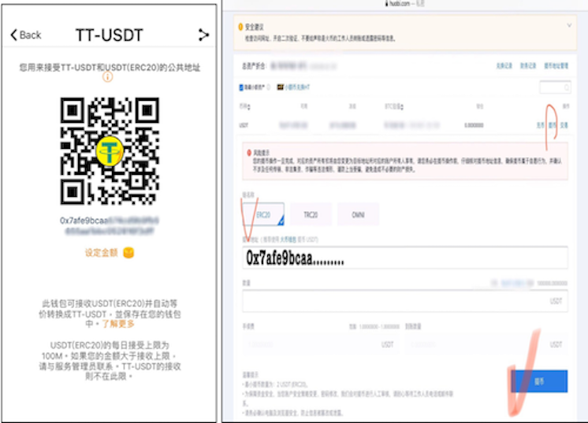
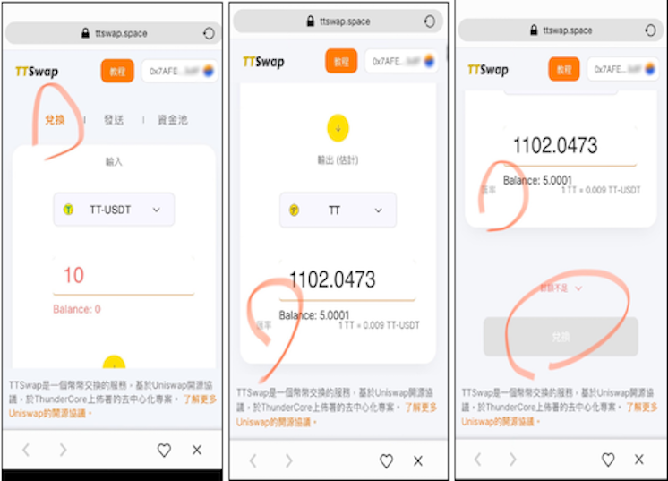

### 下载  ThunderCore Hub
您可以从：
1. 官网下载 [ThunderCore Hub](https://www.thundercore.com/thundercore-hub/?lang=zh-hans) 
2. [Apple Store](https://apps.apple.com/tw/app/thundercore-hub/id1471222243) / [Google Play](https://play.google.com/store/apps/details?id=com.thundercore.mobile&hl=en) 直接搜寻「ThunderCore Hub」或「TT站」开始下载



### 使用脸书、谷歌或微信登入(注册)帐户 


### 点击左下浏览器后会出现以下图片。您可以在网址输入栏位，直接输入网址「[TTSwap.space](https://ttswap.space/#/swap)」以直接进入该服务

*注意：您须先代币存入 ThunderCore Hub 钱包，该页面的精选列表才会显示



### 将代币存入 ThunderCore hub 钱包后，在精选列表中找到并点击 TTSwap



### 如果您想先了解当前 TTSwap 内的兑换汇率，点选资金池后在「选择代币」的选单中选择「TT-USDT」



### 即会在下列栏位中显示该币种的即时兑换汇率



### 从 [火币](https://www.huobi.com/en-us/exchange/tt_usdt/) 提领您的 USDT 到 ThunderCore Hub 钱包
a) 登入火币个人帐户后，点击 `“资产”` 中的 `“币币帐户”`（充币＆提币）



*图例中火币的 TT/USDT 交易对价格为 ```0.09465```

b) 币种选择 `“USDT”`，链名称选择 `“ERC20”`，输入提币地址及金额，再按蓝色提币钮即可 



__**提币地址输入方式**__

1. 在 ThunderCore Hub 点选下方「钱包」，点击 TT-USDT 后点击「接收」后会显示提币地址：__*0x7afe9bcaa…..*__
2. 将该地址复制并黏贴于火币的提币地址中，并输入金额，按蓝色提币按钮即可将火币帐户中的 USDT 发送至 ThunderCore Hub 并同时转换为 TT-USDT。





__**什么是 TTSwap?**__

您可以将 TTSwap 想像是一个换钱所，让您进行代币(TT、TT-USDT、TT-DAI)之间的兑换，而兑换的汇率则取决于市场机制(即有使用该服务的人来决定)。

__**关于在 TTSwap 进行兑换**__

在TTSwap的页面中，在「兑换」中的输入中选择 TT-USDT，下方的输出里选择 TT，如此您将会将您的 TT-USDT 兑换为 TT。您选择的数量会影响下方出现的汇率，请根据您的需求兑换想要的汇率。 (注意：您首次在 TTSwap 交易时需同意该服务存取您的钱包)，输入完毕后，点击橘红色的「兑换」即可进行交易。



*此图例中的汇率 1TT= ```0.009``` TT-USDT

### 交易完成后，可以将 TT 传送回火币上的个人帐户上进行买卖

* [TTSwap - 教程(桌机版)](https://ttswap.space/TTswapTutorial-cn.pdf)
