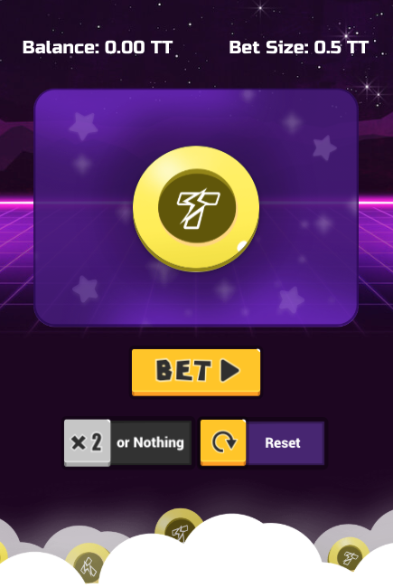

## 总览
让我们利用 5-10 分钟透过 ThunderCore 来部署一个完整且可被你自己的亲友轻松进入的游戏--任何人有网路皆可存取。我们将会发布一款简单的抛硬币游戏，如果硬币的面朝上，玩家将获得两倍的赌注。在硬币面朝下的情况中，玩家将失去他们的赌注，但仍有机会加倍赌注。


## 游戏探索
我们需要获取一个 [钱包](get-wallet.md) 并存取 ThunderCore 的网络以开始游戏。 使用 [Metamask](https://metamask.io/) 
或 [Trust Wallet](https://trustwallet.com/) 所指向的 Thunder RPC，并浏览 [这里](https://thundercore.github.io/DoubleOrNothing/)
以探索我们在教程中设计的游戏。




你只需查看 [repo](https://github.com/jiang-yifan/jiang-yifan.github.io) 并按照 Readme 中的说明操作即可制作你自己的版本。

在上述说明的最后，你应可透过你行动装置中的 Metamask 或任何与 ThunderCore 相容的行动 DApps 浏览器存取游戏。


## 部署你自己的合约
现在，让我们将你的游戏在你自己的合约副本中运行，并与数百万人同行。

首先我们须装载所有的元件。 
```
node -v
# 确保我们的节点是 v8 或 v10
```
如果你的版本不兼容， 用 [HomeBrew](https://brew.sh/) 装载它，
```
brew install node@10
```
或者前往 [Node.js](https://nodejs.org/en/download/package-manager/) 以安装正确的版本。


```
cd ./smart-contracts
```
```
yarn install
# or 
npm install
```

接着自 Metamask 或 TrustWallet 中获取你的助记词后，并以 `truffle-config.js` 将其加入 HDWallet 中。

```
yarn migrate --network thunder --reset
# or 
npm run migrate -- --network thunder --reset
```

在 console 中，你将看到你为部署所支付的价格、合约地址和其他统计信息。做得好！你的合约现已开始运行，并可供任何人使用。

现在我们必须更新我们的使用者介面以使用这个合约。

```
cd ./frontend
```

```
yarn install
# or 
npm install
```

找到 `.env` 档案并更改 `REACT_APP_CONTRACT_ADDRESS` 至你的新地址。
```
yarn start
# or
npm run start
```
这将启用你更改的本地伺服器。

如果你想要将此部署至你的网页运行：

```
yarn build
# or 
npm run build
```

```
git add -u

*Remember to not check in your mnemonic!!!! 
``` 

```
git commit -m 'add my own contract address'
```

```
git push
```

好了！你的网页将会于5 - 10秒内在你的合约中运行。恭喜你！ 
