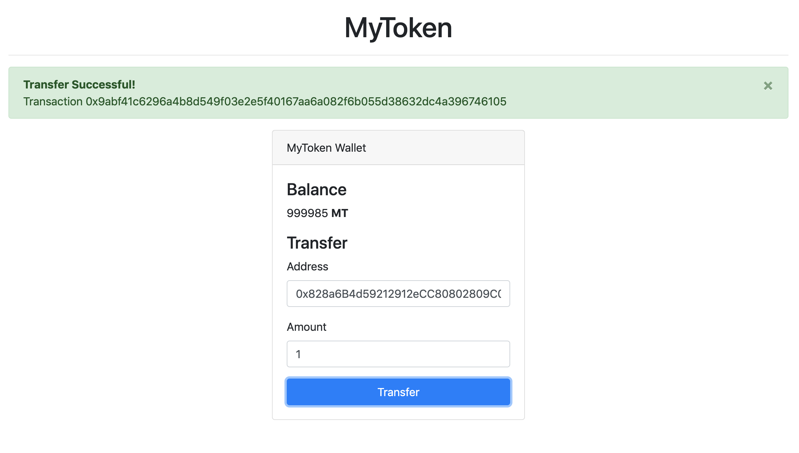

[ERC-20](https://theethereum.wiki/w/index.php/ERC20_Token_Standard) 代币是区块链社区中最受欢迎的 DApps 之一。这篇教程将会在简单的五个步骤中引导你在 ThunderCore 上部署 ERC-20 智能合约，既简单又快速！

最新版的 repo 在此：https://github.com/LucienLee/thundercore-erc20.

## 需求
这份教程预期你对于 Truffle、以太坊、Metamask 与 Solidity 有基本的认识。 

###  装载开发工具
请装载以下内容：

- [Node.js v8+ LTS and npm](https://nodejs.org/) (随 Node 一并)
- [Git](https://git-scm.com/)
- [Yarn](https://yarnpkg.com/) (非必要)

一旦装载了这些工具，我们只需要一个指令来安装 Truffle：

```bash
npm install -g truffle
# or 
yarn global add truffle
```
要验证 Truffle 是否已正确装载，请在终端上键入 `truffle version` 。


### 装载 Metamask
MetaMask 作为钱包的浏览器插件，其可安全地存储您的加密货币，如以太币 (ETH) 和 Thunder Token，它还可以作为连接 Web 应用程序和区块链间的“桥梁”。你可以在 [https://metamask.io/](https://metamask.io/) 下载并了解有关 Metamask 的更多信息。

### 获取 Thunder Token 或测试用 Thunder Token
你需要获得 Thunder Tokens (主网) 或测试用 Thunder Tokens (测试网) 才能在 ThunderCore 上部署智能合约。请按照此 [说明](get-tokens.md) 获取你的代币。


# 步骤
在本教程中，我们将介绍：

- 揭示 ThunderCore Boilerplate Box 
- 创建 “MyToken” 智能合约
- 在 ThunderCore 上编译和部署智能合约
- 与新代币进行互动

## 1. 揭示 ThunderCore Boilerplate Box 
为了让 ThunderCore 更容易使用，我们为 ThunderCore DApps 创建了一个可以通过 Truffle 下载的模板：[Thunder Box](https://github.com/thundercore/thunder-box)。在终端上，建立一个新项目分类并找到它：

```bash
truffle unbox thundercore/thunder-box
```

接下来，我们将安装 OpenZeppelin 2.x。最新版本的 OpenZeppelin 可以在 npm 组件包中找到。

```bash
npm install openzeppelin-solidity@2.5.1
# or 
yarn add openzeppelin-solidity@2.5.1
```

## 2. 创建 "MyToken" 智能合约
让我们先建立我们的代币合约，我们通过扩展 `StandardToken` 合约来构建代币。

1. 在 Truffle Box 的合约/目录中，建立 `MyToken.sol` 文件并加入以下内容：

```solidity
pragma solidity ^0.5.0;

import "openzeppelin-solidity/contracts/token/ERC20/ERC20.sol";

contract MyToken is ERC20 {

}
```

2. 欲为代币设置我们自己的参数，我们将声明自己的名称、符号和其他详细信息，並将以下内容区块添加到合约中 (在大括号间)：

```solidity
string public name = "MyToken";
string public symbol = "MT";
uint8 public decimals = 0;
uint public INITIAL_SUPPLY = 1000000;
```

注意事项：

- `name` 和 `symbol` 的变化量为我们的代币提供了独特的标识。
- `decimals` 的变化量决定此代币可细分的程度。 
- `INITIAL_SUPPLY` 的变化量决定了部署此合约时创建的代币数，在此情况下的数字是随机任意的。

3. 为了完成我们的合约，我们将创建一个构造函数，使 `totalSupply` 等于我们声明的 `INITIAL_SUPPLY` ，并将整个供应提供给部署帐户的地址。在上一步你所添加的内容下方添加此区块：

```solidity
constructor() public {
  _mint(msg.sender, INITIAL_SUPPLY);
}
```

现在，我们有自己的代币啰！

## 3. 编译和部署智能合约

1. 在 migrations / directory 中，建立 `2_deploy_contracts.js` 的文件并加入以下内容：

```js
var MyToken = artifacts.require("MyToken");

module.exports = function(deployer) {
  deployer.deploy(MyToken);
};
```

2. 启用 local chain 来测试我们的合约。藉由使用这个方式，我们可以在不消耗正式代币的情况下测试我们的合约。我们推荐使用 [Ganache](https://github.com/thundercore/ganache)，或使用以下指令装载 CLI 工具。

```bash
npm install -g thundercore/ganache-cli#tt
```

接着，双击该图示以启用应用程序或运行指令 ganache-cli 以启动 local chain。

3. 启用区块链后，运行以下指令来编译和部署合约。

```
truffle compile
truffle migrate
```

你将看到与此类似的输出：

```bash
Compiling your contracts...
===========================
> Everything is up to date, there is nothing to compile.


Starting migrations...
======================
> Network name:    'development'
> Network id:      5777
> Block gas limit: 0x6691b7


1_initial_migration.js
======================

   Deploying 'Migrations'
   ----------------------
   > transaction hash:    0x90c43c39c9d345211f084b651f3f09146b5fe060003e1e4e4e8b17d0cfcbb712
   > Blocks: 0            Seconds: 0
   > contract address:    0x9FDD2E351c874368852e97A0E7e5Ad93f76070B3
   > block number:        1
   > block timestamp:     1561018014
   > account:             0xdFaDd603Ceb6a3250A0dDA3535ba5c33268d4118
   > balance:             99.99552962
   > gas used:            223519
   > gas price:           20 gwei
   > value sent:          0 ETH
   > total cost:          0.00447038 ETH


   > Saving migration to chain.
   > Saving artifacts
   -------------------------------------
   > Total cost:          0.00447038 ETH


2_deploy_contracts.js
=====================

   Deploying 'MyToken'
   -------------------
   > transaction hash:    0xbc7d07470a485de1b6da13f99823d2a4d0e1957f2e5ed572a2f153fda96de8be
   > Blocks: 0            Seconds: 0
   > contract address:    0x9188f53DAF897E8f2A63aB30fC711950B7D92A30
   > block number:        3
   > block timestamp:     1561018015
   > account:             0xdFaDd603Ceb6a3250A0dDA3535ba5c33268d4118
   > balance:             99.97891304
   > gas used:            788900
   > gas price:           20 gwei
   > value sent:          0 ETH
   > total cost:          0.015778 ETH


   > Saving migration to chain.
   > Saving artifacts
   -------------------------------------
   > Total cost:            0.015778 ETH


Summary
=======
> Total deployments:   2
> Final cost:          0.02024838 ETH
```

现在，你的 `MyToken` 已经部署并填充到你在 ganache 中的第一个地址。

## 4. 部署到 ThunderCore 测试网与主网
现在，你可以准备将代币部署到 ThunderCore 测试网与主网，请确保你有 ThunderCore 的测试代币或主网代币。

1. 首先，你将帐户的控制权设置为 truffle，你可以通过以下方式设置：
    - 将12个字的助记词 (seed phrase) 写入名为 .mnemonic 的文件中
    - 将你的帐户私钥 (每行一个) 导出到名为 .private-keys 的文件

    ```bash
    # If you use private keys
    mv .private-keys.template .private-keys

    # in .private-keys file, put your private keys
    e59cb5e369b65eee650f90f3280cbe8039db81335943ac7a88df5f4df...
    d92a96fa691a7c31b2e2891de05cacc85d562b128afa6bb8f7108aac7...

    # If you prefer mnemonic
    mv .mnemonic.template .mnemonic

    # In .mnemonic file, put your mnemonic
    dog cat apple bird ...
    ```

    如果你使用 Metamask 控制您的地址，你可以在 [此处](https://metamask.zendesk.com/hc/en-us/articles/360015289632-How-to-Export-an-Account-Private-Key) 查看如何导出私钥。你使用的地址将填入你的 `MyToken`。

2. 编译并迁移测试网与主网的合约

    ```bash
    # Deploy to testnet
    truffle compile --network thunder-testnet
    truffle migrate --network thunder-testnet

    # Deploy to mainnet
    truffle compile --network thunder-mainnet
    truffle migrate --network thunder-mainnet
    ```

## 5. 与新代币进行互动

现在，我们准备设置我们的网页，以便用户与我们的代币进行互动。在本教程中，我们专注于智能合约的创建，而非合约与前端和 Web 3 间的联系。因此我们在 https://github.com/LucienLee/thundercore-erc20/tree/master/client 将举一个例子作为说明，如果你对细节有兴趣，你可以查询最后的参考资料。

1. 将 [https://github.com/LucienLee/thundercore-erc20/tree/master/client](https://github.com/LucienLee/thundercore-erc20/tree/master/client) 中的所有文件复制到本地客户端文件夹，我们建议你将整个项目的客户端文件夹复制并粘贴到你自己的文件夹中。

2. 装载前端 deps
```bash
cd client

npm install 
# or 
yarn install
```
3. 使用 `npm start` 或 `yarn start` 运行前端页面，可以在 http://localhost:1234 访问使用者介面。

4. 如果你想在网络上托管，请运行 `npm run build` 或 `yarn build`. 。 接着，你将在 `client / dist` 页面获取 UI 包，并可以通过网络上的任何静态服务器进行托管。 

5. 切换至你以前部署的 Metamask 帐户，你将看到你的代币并可以转移至其他帐户。

### 须知
- 如果你尝试使用本地 ganache，请确保将自定义网络设置为本地链。例如，将 rpc url 设置为 `http://localhost:9545` 和 `chain id 5777`。然后，你可以将私钥从 ganache 导入 Metamask，或者打开不带 Metamask 的浏览器 (如无痕视窗) 来查看你的代币。
- 如果你重新命名合约名称，请确保将 `class name` 第7行中被导入的代码已设置为 artifacts。 

  ```js
  // If you change the name of contract, make sure you set the right reference here
  import TutorialTokenArtifact from "../contracts/<your token contract name>.json";
  ```





## 了解更多有关 DApps 的信息
由于审视代码超出了本教程的范围，但如果你想了解更多有关智能合约编程和构建 DApps 的信息，我们建议使用官方的 [Solidity](https://solidity.readthedocs.io/en/develop) 文档和 [truffle tutorial](https://www.trufflesuite.com/tutorials) 教程。

如有问题，请前往我们的 [Discord](https://discord.gg/5EbxXfw)。


祝你编程愉快顺利!😆

### 参考资料
- [building robust smart contracts with openzeppelin](https://www.trufflesuite.com/tutorials/robust-smart-contracts-with-openzeppelin)
- [solidity](https://solidity.readthedocs.io/en/develop/)
- [web3](https://github.com/ethereum/web3.js/)
- [Customized Ganache for ThunderCore](https://github.com/thundercore/ganache)
- [Customized ganache-cli for ThunderCore](https://github.com/thundercore/ganache-cli)
