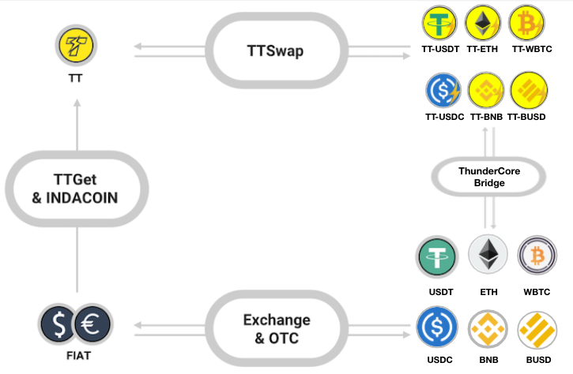

## Intro
有多种方法可以在 ThunderCore 上获取 ERC-20 和 BEP-20 代币，您可以找到一种适合您进入 ThunderCore 并开始体验超快速且安全区块链的方法。 

## 服务范围
下图每条线都是双向的：

## 用途
_如果你是一个数字货币持有者_

* 如果你想透过 USDT, WBTC, ETH, BNB, BUSD, USDC 获得 TT： 
  1. 你可以从 [这里](https://coinmarketcap.com/currencies/thunder-token/#markets) 获得 TT  
  2. 点击 “Pair” 将引导您到交易对进行交易

* 通过 [ThunderCore Bridge](https://bridge.thundercore.com/) 将您的 ERC-20 和 BEP-20 代币到 ThunderCore.

### ERC-20 代币到 ThunderCore
  1. 请参考 [ThunderCore Bridge](https://bridge.thundercore.com/eth/)并启用 Web3 钱包(例如 MetaMask)以启动 
  2. 输入您要转换的 USDT 的金额 
  3. 等待区块确认，如交易完成，您将看到成功页面 
  4. 如果您对 [ThunderCore Bridge](https://bridge.thundercore.com/eth/) 仍有其他疑问，请查看 [教程](https://docs.thundercore.com/docs/ThunderStableCoinTutorial.pdf)

### BEP-20 代币到 ThunderCore
  1. 请参考 [ThunderCore Bridge](https://bridge.thundercore.com/bsc/)并启用 Web3 钱包(例如 MetaMask)以启动 
  2. 输入您要转换的 USDT 的金额 
  3. 等待区块确认，如交易完成，您将看到成功页面 
  4. 如果您对 [ThunderCore Bridge](https://bridge.thundercore.com/bsc/) 仍有其他疑问，请查看 [教程](https://docs.thundercore.com/docs/ThunderStableCoinTutorial.pdf)

* 通过 [TTSwap](https://ttswap.space/#/swap) 以 TT20 代币交换 TT
  1. 请参考 [TTSwap](https://ttswap.space/#/swap) 并启用 Web3 钱包(例如: MetaMask)以启动 
  2. 选择代币的输入额和输出额以启动  
  3. 等待该过程，您将获得你所输入金额所对应的代币 
  4. 查看 [教程](https://support-center-cn.thundercore.com/docs/ttswap/) 以了解更多信息

_如果你没有任何数字货币_

* 如果您想开始使用 TT 探索 ThunderCore 生态系统：
  1. [TTGet](https://indacoin.io/buy-thundertoken-with-card) - 使用信用卡获取 TT(支持 Visa、Mastercard 和 JCB)
     * 请参考 [TTGet](https://indacoin.io/buy-thundertoken-with-card) 并启用 Web3 钱包(例如 MetaMask)以启动 
     * 查看 “How to Buy” 以了解有关 TTGet 的更多信息
     * 点击 “Buy now” 将自动与您的 MetaMask 连接
     * 选择您要购买的方案
     * 如果您对 TTGet 有其他疑问，请查看 [FAQ](https://ttget.appcenter.games/)
  2. [IndaCoin](https://indacoin.io/buy-thundertoken-with-card) - 立即使用信用卡或借记卡获取 TT (不适用于美国、中国、日本等国家/地区)
* 如果你没有任何 TT 或 TT-稳定币：
您可以通过加密货币交易所(如 Huobi、Upbit 或 Pionex)购买，也可以自行透过场外交易获得。

* 如果您想了解更多关于 WBTC，请参考[这里](https://wbtc.network/)。
