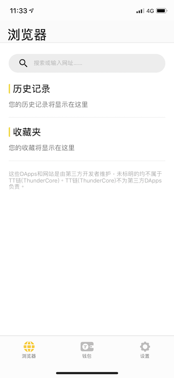
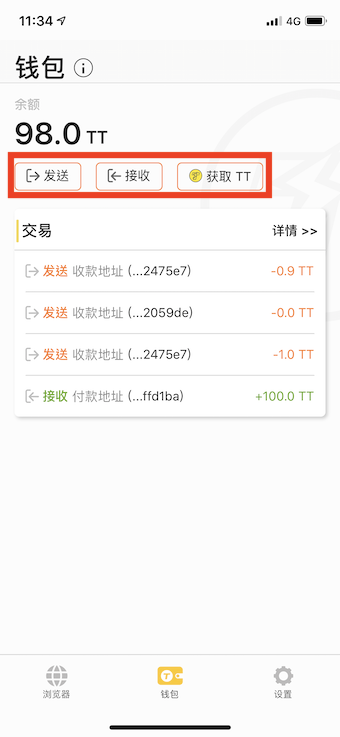
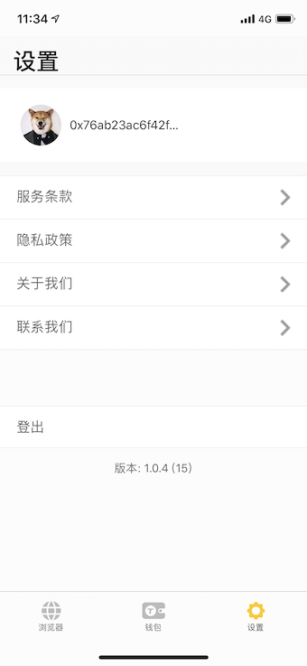
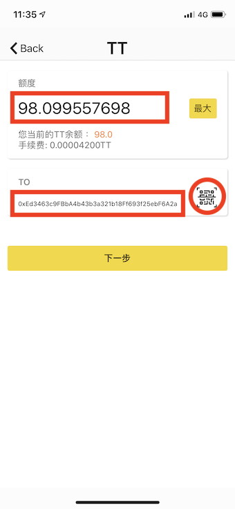
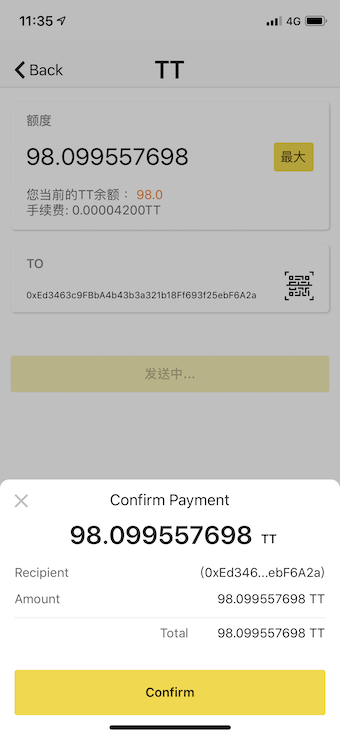
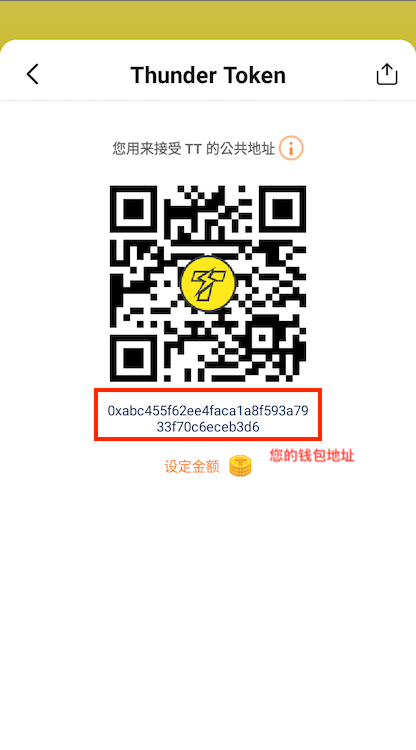
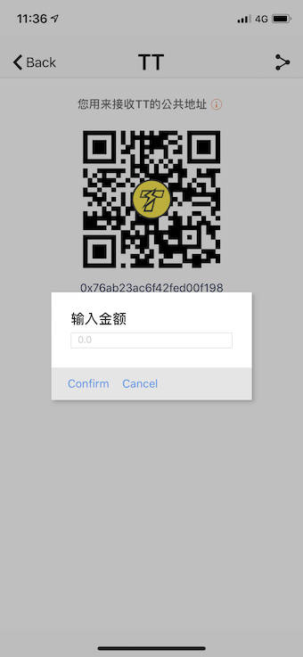

## 准备入门
为了使用 ThunderCore 区块链 (及其他大多数的区块链)，你将需要一个钱包地址，此地址的工作方式类似于信用卡号。

## ThunderCore Hub

ThunderCore Hub 是一款安全且易于使用的加密钱包，具有完整的 DApp 浏览器功能。

### 装载 ThunerCore Hub
在 [iOS](https://0x7.me/HIF4) 及 [Android](https://static.hljwlrd.com/apk/thundercore-hub) 装载 ThunderCore Hub 并按照以下说明操作。
亦可从 [App Store](https://apps.apple.com/tw/app/thundercore-hub/id1471222243) 或 [Google Play](https://play.google.com/store/apps/details?id=com.thundercore.mobile) 装载。

### 有关 ThunderCore Hub 的概览
1. 打开应用程序后，您可以通过3种方式登录钱包。

2. 然后，您将看到“浏览器”页面，您可以在搜索栏中输入 DApp 或网站的 URL。

3. 点击钱包分页，然后您会看到钱包页面，此页面将显示您的 Thunder Token（TT）余额和您所做过的所有交易。同时，您可以透过这个页面 `发送` 、 `接收` 或 `获取 TT`。

4. 您可以透过设置页面联系我们或登出。

### ThunderCore Hub 的特色

#### 发送代币

要发送代币，请单击 `发送` 按钮，然后您将看到如下所示：

此页面显示 TT 的余额，您可以在空白处输入接收方的地址。

您也可以通过二维码扫描器发送代币到另一个地址。

单击 `Confirm` 以继续接下来的步骤。

#### 接收代币

要接收代币，请单击 `接收` 按钮，然后您将看到如下所示：

如果您想让其他地址收到特定金额，可以自己设置金额。

接收方将收到与您输入的金额相同的金额。

 #### 购买 Thunder Token

 如果您没有任何 Thunder Token (TT)，[现在就购买](https://www.appcenter.games/ttget)。

 #### 如何分享我的钱包地址？

 请转到接收页面并单击右上角的图标，您将看到如下所示：

 

 只需将其复制并粘贴到您的笔记本或任何您想要的位置即可。
