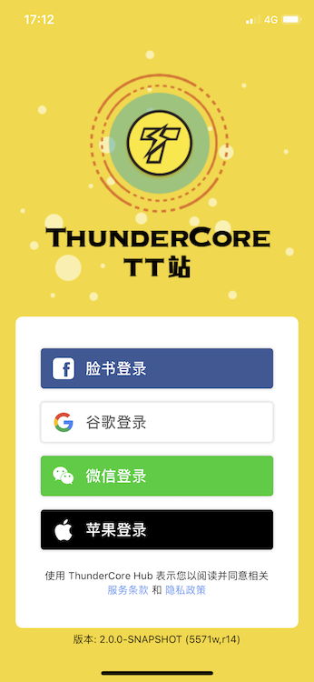
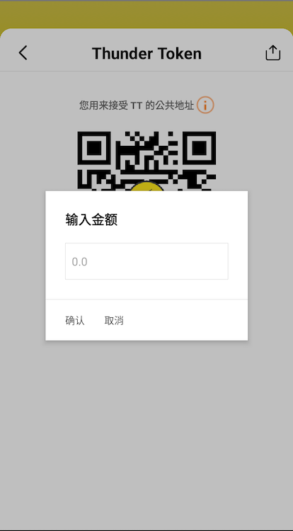
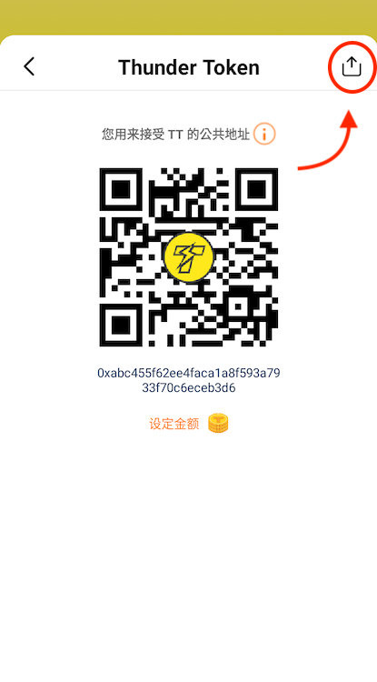
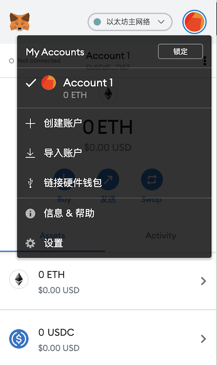
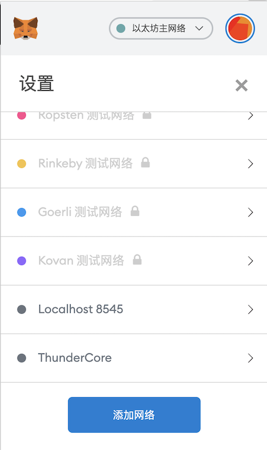
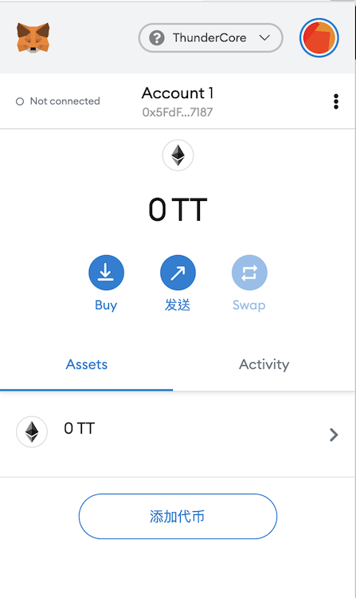

## 准备入门
为了使用 ThunderCore 区块链 (及其他大多数的区块链)，你将需要一个钱包地址，此地址的工作方式类似于信用卡号。

## ThunderCore Hub

ThunderCore Hub 是一款安全且易于使用的加密钱包，具有完整的 DApp 浏览器功能。

### 装载 ThunerCore Hub
在 [App Store](https://apps.apple.com/tw/app/thundercore-hub/id1471222243) 或 [Google Play](https://play.google.com/store/apps/details?id=com.thundercore.mobile) 装载 ThunderCore Hub 并按照以下说明操作。

### 有关 ThunderCore Hub 的概览
1. 打开应用程序后，您可以通过3种方式登录钱包。

2. 然后，您将看到“浏览器”页面，您可以在搜索栏中输入 DApp 或网站的 URL。

3. 点击钱包分页，然后您会看到钱包页面，此页面将显示您的 Thunder Token（TT）余额和您所做过的所有交易。同时，您可以透过这个页面 `发送` 、 `接收` 或 `获取 TT`。

4. 您可以透过设置页面联系我们或登出。

### ThunderCore Hub 的特色

#### 发送代币

要发送代币，请单击 `发送` 按钮，然后您将看到如下所示：

此页面显示 TT 的余额，您可以在空白处输入接收方的地址。

您也可以通过二维码扫描器发送代币到另一个地址。

单击 `Confirm` 以继续接下来的步骤。

#### 接收代币

要接收代币，请单击 `接收` 按钮，然后您将看到如下所示：

如果您想让其他地址收到特定金额，可以自己设置金额。

接收方将收到与您输入的金额相同的金额。 

 #### 购买 Thunder Token 
 
 如果您没有任何 Thunder Token (TT)，[现在就购买](https://www.appcenter.games/ttget)。
 
 #### 如何分享我的钱包地址？
 
 请转到接收页面并单击右上角的图标，您将看到如下所示：
 
 
 
 只需将其复制并粘贴到您的笔记本或任何您想要的位置即可。

## MetaMask

MetaMask 是一个可以让你持有 Thunder Token (TT) 的数位钱包，以下说明向你展示如何启用 MetaMask 以及如何与 ThunderCore 平台一起使用。
​
### 装载 MetaMask
在 https://metamask.io/ 下载 MetaMask 的 Google 插件，并按照下列指示：
​
### 与 ThunderCore 连接
1. 在浏览器中启动 MetaMask
 

​
2. 单击右上角的圆形图标 (你的屏幕会有一个不同的图标，但其工作原理相同)
​
​

3. 单击此窗口底部的 `Settings` ，然后向下滚动到 `Networks` 以添加新网络。

​

4. 再次向下滚动以单击 `Add Network` 按钮。

​

5. 在下一个屏幕中，键入下列信息：

Field | Value
----- | -----
**Network name** | ThunderCore
**New RPC URL** | https://mainnet-rpc.thundercore.com
**ChainID** | 108
**Symbol** | TT

6. 收到 Thunder Token (TT) 后，主屏幕上的 MetaMask 帐户信息将会更新。

7. 点击右上角的 X 以返回主屏幕。

8. 单击主地址行下方的帐户名称会将你的地址复制到剪贴板。

 
### ​​MetaMask 中的已知问题
 
由于 MetaMask 最初是为以太坊开发的，因此当你将其用于 ThunderCore 主网时，MetaMask 中显示的某些信息可能会有误导。 需注意的是，在其 UI 中有许多地方使用 ETH (Ether) 作为单位，但它们其实指的是 Thunder Tokens (TT)，甚至，美元数字也是不正确的，因为它们是使用以太币的价格计算的。

## Ledger Nano S
要了解有关如何设置 Ledger Nano S 的更多信息，请参阅 [此处](https://developers.thundercore.com/docs/ledger-nano-s/)
​
## Trust Wallet
Trust Wallet 是一款行动版的以太坊钱包，支持许多 ERC20、ERC223、ERC721代币，如以太坊、以太坊经典、Callisto 和 Thunder Token 等代币。目前 Trust Wallet 可以存取超过20,000个基于以太坊为基础的代币，同时 Trust Wallet 也是币安的官方用户加密钱包。
 
Thunder Token (TT) 已与 Trust Wallet 整合，因此你可以立即开始发送、接收和存储 Thunder Tokens (TT) 并使用T hunder Token DApps！本教程将引导你轻易完成 Trust Wallet 设置并获取 Thunder Token。
 
在 Apple 的 App Store 或 Google play 上搜索 “Trust Wallet”。

下载应用程序并设置 seed phrase 后，你只需将 Thunder Token (TT) 以代币添加至钱包中。  
 
### 开始使用 ThunderCore

#### 步骤1
点击钱包屏幕右上角的 `+` ，如下所示：

#### 步骤2
搜索 Thunder 并添加 Thunder Token 代币

恭喜！你已在 Trust Wallet 上设置了 ThunderCore 地址！
