## 介绍
*注意：本教程以苹果手机 iPhoneX 作为示范，其他型号苹果手机下载方式皆同。*

## 步骤

1. 使用手机中的 Safari 访问 https://0x7.me/HIF4 

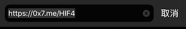

   或扫描下方二维码进入下载
   

2. 点击「免费安装」以下载该描述档

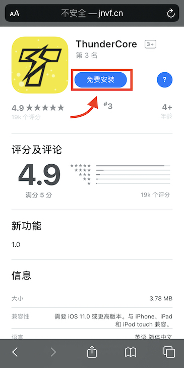

3. 屏幕会询问您是否允许安装该描述文件，请点击「允许」以继续

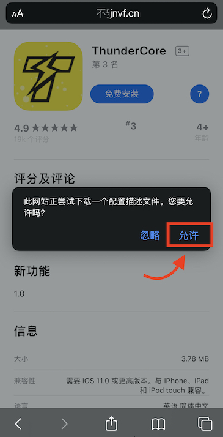

4. 屏幕接着会提醒您自手机「设置」中查看该描述档，请点击「关闭」

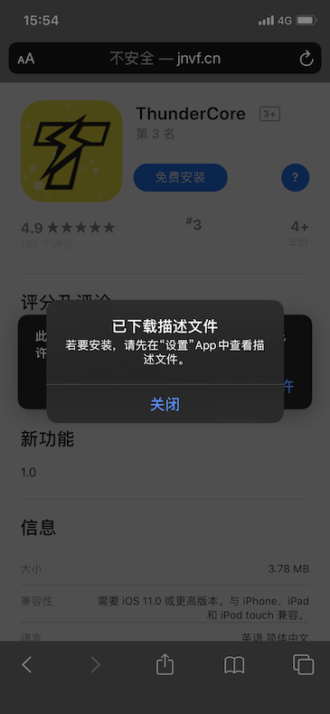
 
5. 屏幕将自动跳转，点击「ThunderCore」以继续

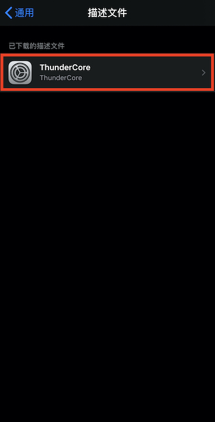
 
6. 请点击「安装」，并输入您的手机屏幕锁 (如果有) 以启动安装步骤

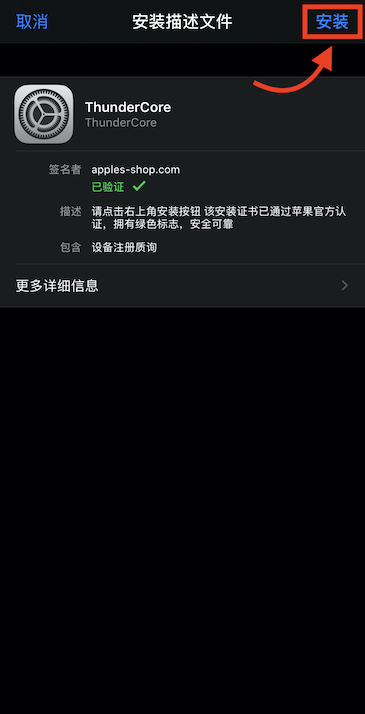

 
7. 点击「安装」开始安装该描述文件

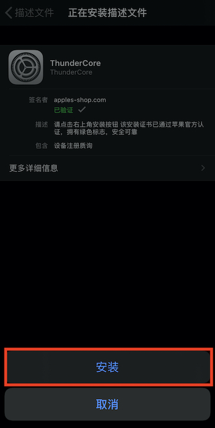
 
8. 安装完成后将跳出以下画面，请点击「打开」，并再次点击「安装」以完成安装步骤

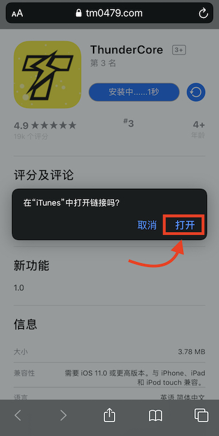 
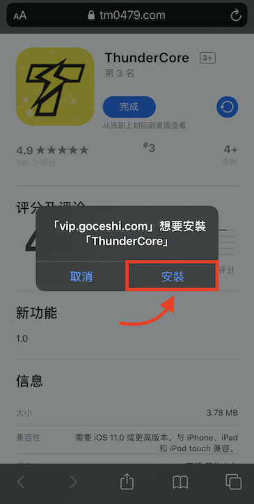  
 
9. 安装完成后，请回到桌面查看

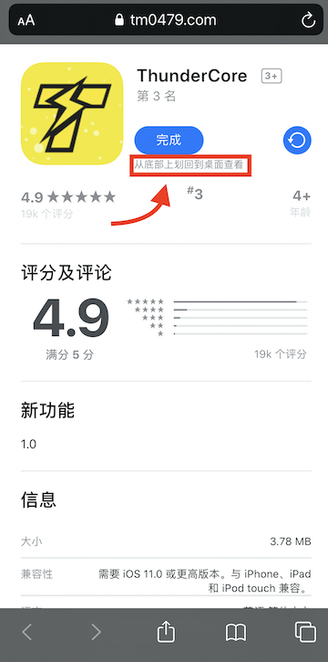  
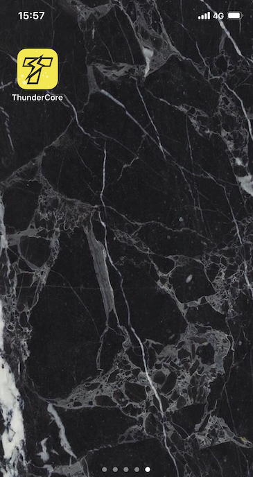 
 
10. 点击进入该应用，并选择您的登录方式即可开始使用 ThunderCore Hub

  
