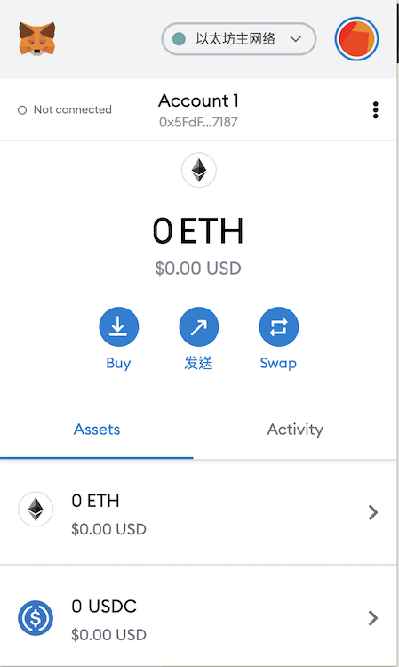
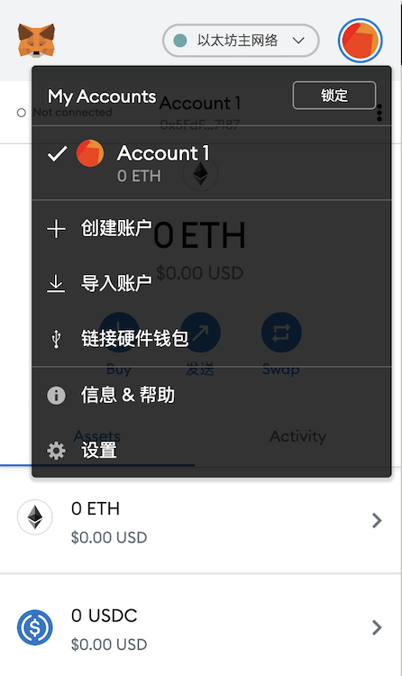
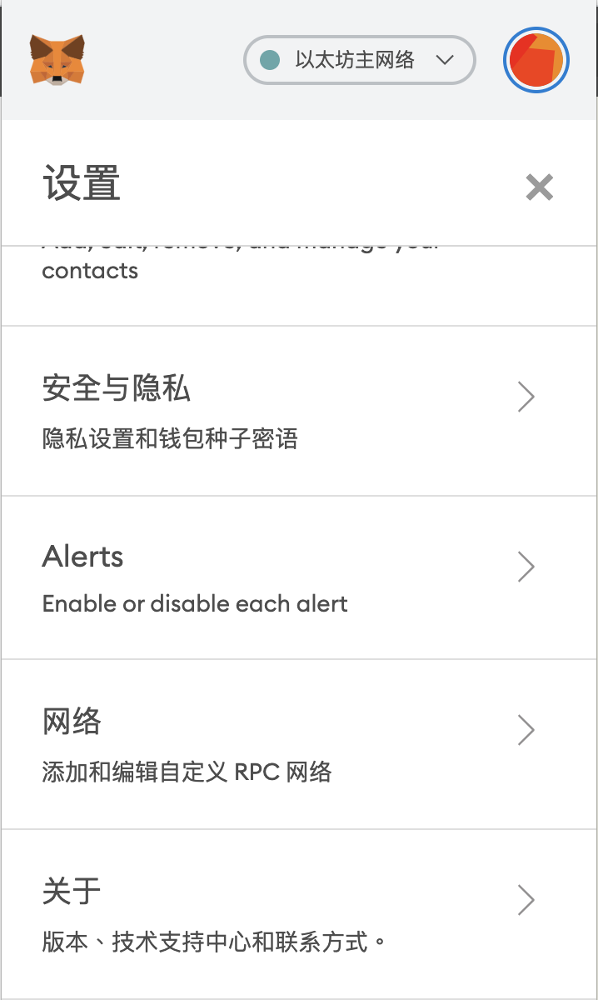
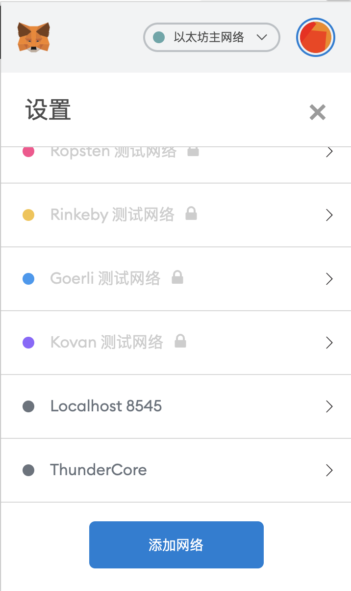
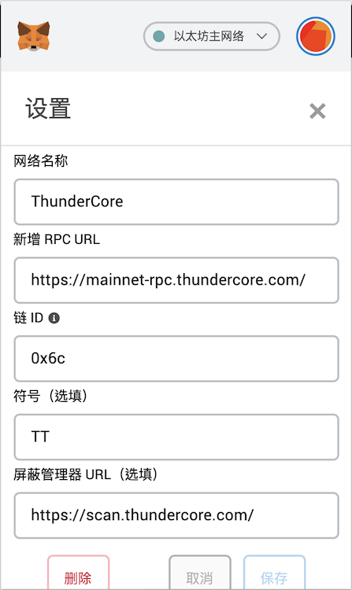
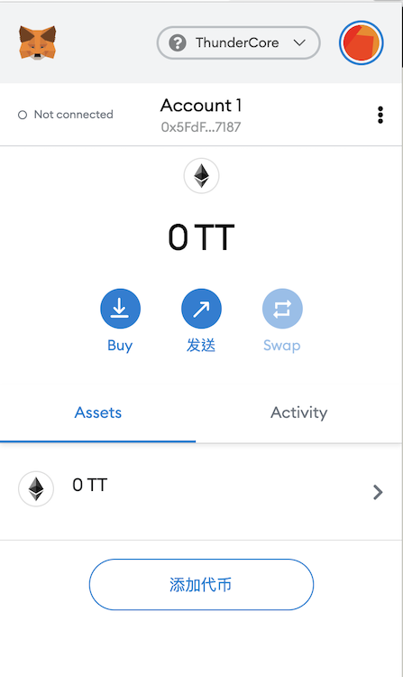

## 准备入门
为了使用 ThunderCore 区块链 (及其他大多数的区块链)，你将需要一个钱包地址，此地址的工作方式类似于信用卡号。

## MetaMask

MetaMask 是一个可以让你持有 Thunder Token (TT) 的数位钱包，以下说明向你展示如何启用 MetaMask 以及如何与 ThunderCore 平台一起使用。
​
### 装载 MetaMask
在 https://metamask.io/ 下载 MetaMask 的 Google 插件，并按照下列指示：
​
### 与 ThunderCore 连接
1. 在浏览器中启动 MetaMask
 

​
2. 单击右上角的圆形图标 (你的屏幕会有一个不同的图标，但其工作原理相同)
​
​

3. 单击此窗口底部的 `Settings` ，然后向下滚动到 `Networks` 以添加新网络。

​

4. 再次向下滚动以单击 `Add Network` 按钮。

​

5. 在下一个屏幕中，键入下列信息：

Field | Value
----- | -----
**Network name** | ThunderCore
**New RPC URL** | https://mainnet-rpc.thundercore.com
**ChainID** | 0x6c
**Symbol** | TT
**Block Explorer URL (optional)**| https://scan.thundercore.com

6. 收到 Thunder Token (TT) 后，主屏幕上的 MetaMask 帐户信息将会更新。

7. 点击右上角的 X 以返回主屏幕。

8. 单击主地址行下方的帐户名称会将你的地址复制到剪贴板。

 
### ​​MetaMask 中的已知问题
 
由于 MetaMask 最初是为以太坊开发的，因此当你将其用于 ThunderCore 主网时，MetaMask 中显示的某些信息可能会有误导。需注意的是，在其 UI 中有许多地方使用 ETH (Ether) 作为单位，但它们其实指的是 Thunder Tokens (TT)，甚至，美元数字也是不正确的，因为它们是使用以太币的价格计算的。