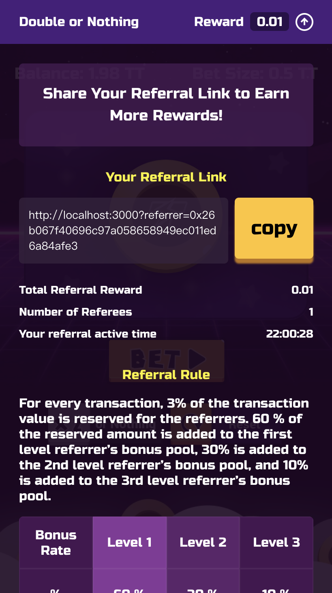

当你的用户在他们朋友面前对你的产品赞不绝口时，没有什么比推荐行销更棒的行销策略了！
许多知名的 DApps 像是 [Fomo3d](https://exitscam.me/), [My Crypto Heroes](https://www.mycryptoheroes.net), [HyperSnake](https://www.hypersnakes.io/e/e/d/index.html)... 都有推荐分润系统。

因此，我们开发了一个智能合约推荐库, [Referral Solidity](https://github.com/thundercore/referral-solidity), 来帮助 DApps 开发人员快速打造自己的推荐分潠系统。我们将解释如何使用我们的库，并展示整合到另一篇翻硬币 DApps 教程的成果。你可以在这里[试玩](https://jiang-yifan.github.io).

## Referral Solidity 库

我们打造了一个多层次推荐库 referral solidty 在 [https://github.com/thundercore/referral-solidity/](https://github.com/thundercore/referral-solidity/). 有了这个库，你可以立马有以下功能:

- 多层次 (目前最大为3层) 原生代币 (ETH, TT...) 系统分润系统 
- 根据推荐人数计算推荐奖金
- 当下线加入游玩立刻驱动付推荐金机制
- 只有活跃用户能领推荐奖金

### 如何使用

首先安装我们的库：

```bash
npm install @thundercore/referral-solidity
```

透过导入、初始化推荐合约、 `addReferrer` 函式绑定上线跟 `payReferral`触发函式推荐金支付等四步，来整合 referral solidity 到你的 DApps。

```solidity
pragma solidity ^0.5.0;
import '@thundercore/referral-solidity/contracts/Referral.sol';

contracts YourGame is Referral {
  // Referral(decimals, referralBonus, secondsUntilInactive, onlyRewardActiveReferrers, levelRate, refereeBonusRateMap)
  constructor() Referral (10000, 500, 1 days, true, [6000, 3000, 1000], [1, 10000]) public {
  }

  // bind uplineAddr as msg.sender's referrer
  function addUpline(address payable uplineAddr) public {
    addReferrer(upline);
  }

  // trigger pay referral in your business logic
  function play() public payable {
    payReferral(msg.value);
  }
}
```

在 `constructor() Referral (10000, 500, 1 days, true, [6000, 3000, 1000], [1, 10000])` 这行, 你可能觉得搞不清这里面参数的意思，我们将一一解释，首先这些建构子参数对应到的以下变数:

```solidity
Referral(decimals, referralBonus, secondsUntilInactive, onlyRewardActiveReferrers, levelRate, refereeBonusRateMap)
```

这里是所有参数的解释:

##### decimals `<uint>`

所有推荐比率计算的基数，由于 Solidity 还没有支援浮点数，使用 decimals 作为所有比率计算的基底。
举例来说，如果 `decimals` 为 `10000` 而且 `referralBonus` 为 `500` 那代表总推荐奖金池比率为 `5%`。

##### referralBonus `<uint>`

总推荐奖金池比率，计算时会跟 `decimals` 相除。举例来说， 如果你想要 `5%` 交易金额用于推荐奖金，你可以将其设为 `50` 对应 `decimals` 为 `1000`。

##### secondsUntilInactive `<uint>`

多少秒没游玩用户为不活跃用户。举例来说 `one days`。

##### onlyRewardActiveReferrers `<bool>`

是否要启用只付费给活跃用户。

##### levelRate `<uint[]>`

每层奖励比率，计算时会跟 `decimals` 相除。目前最大层数为 3。举例来说，设置 `levelRate` 为 `[6000, 3000, 1000]` ，对应 `decimals` 为 `10000` ，代表以下状况:

|      | 1级推荐 | 2级推荐 | 3级推荐 |
| ---- | ------ | ------ | ------ |
| 比率 | 60%    | 30%    | 10%    |

##### refereeBonusRateMap `<uint[]>`

推荐人数奖励比率，计算时会跟 `decimals` 相除。目前最大层数为 3，人数奖励对应表传参格式如 [ `<最低人数>`, `<比率>`, ... ]。 举例来说，你应该传递 `[1, 2500, 5, 5000, 10, 10000]` 对应 `decimals` 为 `10000` 代表以下状况: 

|      | 1 - 4 | 5 - 9 | 10+  |
| ---- | ----- | ----- | ---- |
| 比率 | 25%   | 50%   | 100% |

让我们看以下例子来大家有个更清楚的理解。

## 示例 - 整合到赌硬币 DApp



在这篇[教程](deploy-your-own-game.md)，你可以布署跟打造自己的翻硬币游戏。现在让我们加入推荐系统到游戏里!
让我们设置以下规则：
- 3% 的赌金会用于推荐
- 在不同的推荐阶层，用户可以得到 3% 中的 60%, 30%, 10% 奖金
- 如果用户只推荐 5 人不到，只能得到 50% 应得的推荐奖金；只推荐 25 人不到，只能得到 75% 应得的推荐奖金；超过 25 人以上才能得到所有应得奖金。
- 用户必须为活跃用户才能领奖金，活跃过期时间为一天，如果有下线玩游戏，但用户为非活跃用户，也不能领到奖金。

因此，假设以下状况：
推荐序列为 A ← B ← C ← D. A 有推荐人 25 人, B 有推荐人 6 人 而 C 有推荐人 1 人。当 D 赌 1 TT 时， 3% 会用来作为推荐奖池也就是 0.03 TT。那每一级上线可以得到:

- A: 1 \* 0.03 \* 0.1 \* 1 = 0.003
- B: 1 \* 0.03 \* 0.3 \* 0.75 = 0.00675
- C: 1 \* 0.03 \* 0.6 \* 0.5 = 0.009

此时建构子参数值如下:

|       | decimals | referralBonus | secondsUntilInactive | onlyRewardActiveReferrers | levelRate       | refereeBonusRateMap        |
| ----- | -------- | ------------- | -------------------- | ------------------------- | --------------- | -------------------------- |
| value | 1000     | 30            | 86400                | true                      | [600, 200, 100] | [1, 500, 5, 750, 25, 1000] |


那接下来，我们就实际整合推荐合约到赌硬币作为示例：

### 合约

首先导入并将参数传递给我们的推荐合约:

```solidity
pragma solidity 0.5.0;

import '@thundercore/referral-solidity/contracts/Referral.sol';
...

contract DoubleOrNothing is Ownable, Referral {
  ...
  constructor(
      uint _decimals,
      uint _referralBonus,
      uint _secondsUntilInactive,
      bool _onlyRewardActiveReferrers,
      uint256[] memory _levelRate,
      uint256[] memory _refereeBonusRateMap
  ) Referral(
      _decimals,
      _referralBonus,
      _secondsUntilInactive,
      _onlyRewardActiveReferrers,
      _levelRate,
      _refereeBonusRateMap
  ) public {}
  ...
```

然后，添加多載 `bet` 函式，如果是调用带有地址的 bet 函式，下注第一次时绑定推荐上线。

Then, add overload bet function to bind referral upline when bet with the address.

```solidity
  function bet(address payable _referrer) payable external {
    if(!hasReferrer(msg.sender)) {
      addReferrer(_referrer);
    }
    bet();
  }
```

下一步，添加 ``payReferral` 到 `bet` 函式里。

```
  function bet() payable public {
    // msg.value is added to the balance to begin with so you need to double it
    require(msg.value * 2 <= address(this).balance, 'Balance too low!');
    uint256 winnings = 0;

    // DO NOT USE THIS IN PRODUCTION, IT IS INSECURE
    if(uint256(blockhash(block.number -1)) % 2 == 0) {
      // 3% is deducted to cover the referral bonus
      winnings = msg.value * 197/100;
      address(msg.sender).transfer(winnings);
    }
    payReferral(msg.value);
    emit BetSettled(msg.sender, winnings);
  }
```

最后，为了布署带有推荐的赌硬币游戏，我们需要在 migration 传递参数。

```js
// migrations/1_initial_migration.js
module.exports = function(deployer) {
  deployer.deploy(Migrations);
  deployer.deploy(
    Double,
    1000,
    30,
    86400,
    true,
    [600, 200, 100],
    [1, 500, 5, 750, 25, 1000]
  );
};
```

### 前端

现在，您可以从合同中的公开变数 `accounts` 获取用户推荐数据，包括用户的总推荐人数和总推荐奖金。

```js
this.props.contract.accounts(this.props.address).then((info: any) => {
  this.setState({
    accountInfo: {
      reward: info.reward.toString(),
      referredCount: info.referredCount.toString()
    }
  });
});
```

然后，你可以从网址解析出推荐人地址，像是 `https://jiang-yifan.github.io?referrer=0x26b067f40696c97a058658949ec011ed6a84afe3`。接下来，透过 `contract.bet(address)` 来触发合约绑定上线，以及 `contract.bet()` 来触发一般赌注，每次赌注都会自动转帐推荐奖金到上线。
更多细节，你可以参考[源代码](https://github.com/jiang-yifan/jiang-yifan.github.io/blob/master/frontend/src/containers/GameContainer/GameContainer.tsx)。
