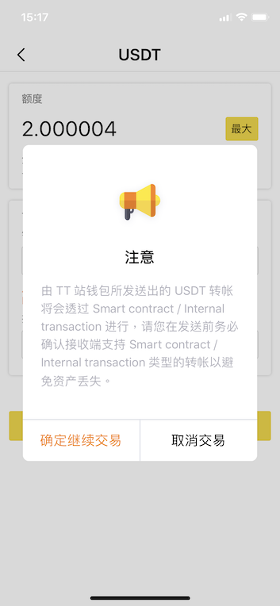
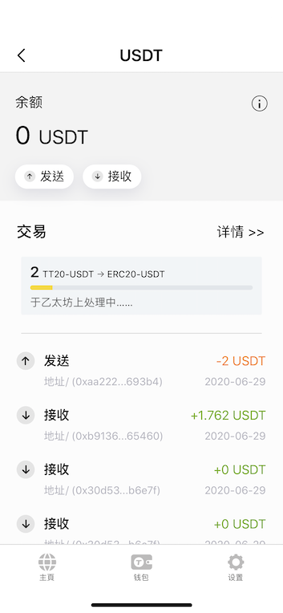
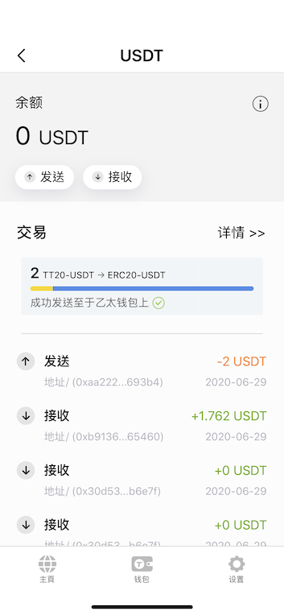

为了使用户更好地体验 TT 链的生态，当您将 USDT / DAI 存入 TT 站时，它将自动转换为 TT20-稳定币。**请不要担心**，此过程是可逆的，当您使用 TT20-稳定币提领到其他钱包时，它将转换回 USDT / DAI。 

## 将 TT20-稳定币自第三方钱包存入 TT 站 

1. 从第三方钱包中提取 USDT (或 DAI)后。打开 TT 站并转到 “钱包” 页面，然后点击 USDT，您将看到如下的交易进度栏。

* 由于以太坊网络，此步骤可能需要一段时间。

2. 等待进度条完成。

3. 交易完成后，您将看到以下屏幕。

4. 检查您的钱包余额。

## 将 TT20-稳定币自 TT 站提领至第三方钱包 

1. 转到 “钱包” 页面，然后点击 USDT。

2. 按发送。

3. 输入您要发送的金额，然后选择 `ERC20-USDT`作为链名，然后输入接收的钱包地址。

* 请仔细选择链名称，发送交易后，该过程将无法恢复。

4. 请仔细阅读说明。

5. 等待处理，当交易完成时，您将在以太坊上看到交易已完成。

6. 您的 USDT 已成功发送。

* 如果要检查 USDT 交易，请转到[以太坊区块链浏览器](https://etherscan.io/) 而不是 ThunderCore Scan（您无法在 ThunderCore Scan 上看到内部转移的交易记录）。

