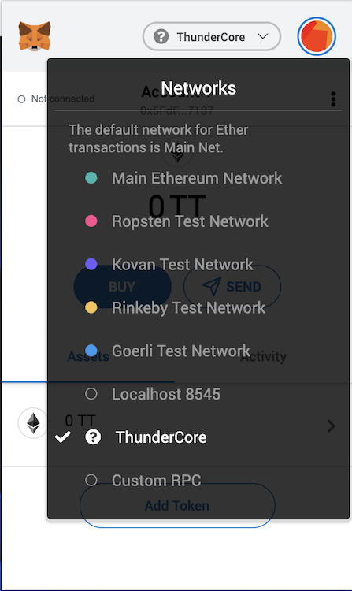

## 介绍
这是向您展示如何将 TT-USDT 或 TT-DAI 添加到您的 MetaMask 的指南。请注意，MetaMask 是一款第三方 Web3 钱包，如果对钱包有疑问，请直接与钱包提供商 [联系](https://metamask.zendesk.com/hc/zh-cn)。

*TT-稳定币： TT-USDT, TT-DAI (了解 [更多](https://www.wikiwand.com/zh-cn/%E7%A8%B3%E5%AE%9A%E5%B8%81) 关于稳定币)*

*如果您想知道如何设置和使用您的 MetaMask，请参考 [这里](https://developers.thundercore.com/docs/get-wallet/#metamask)*

## 将 TT-USDT 添加到 MetaMask

1. 打开您的 MetaMask，并确保网络已切换到 ThunderCore 

2. 点击菜单

3. 点击添加代币

4. 在标签中选择自定义代币 

5. 将 `0x4f3C8E20942461e2c3Bdd8311AC57B0c222f2b82` 复制到代币合约地址，其他空白栏位将自动填入，按下一步继续

6. 按添加代币继续

7. 然后，您将看到 TT-USDT 列在您的 MetaMask 中

## 将 TT-DAI 添加到 MetaMask

1. 打开您的 MetaMask，并确保网络已切换到 ThunderCore

2. 点击菜单

3. 点击添加代币

4. 在标签中选择自定义代币

5. 将 `0x2b31e3b88847f03c1335E99A0d1274A2c72059DE` 复制到代币合约地址，其他空白栏位将自动填入，按下一步继续

6. 按添加代币继续

7. 然后，您将看到 TT-DAI 列在您的 MetaMask 中

