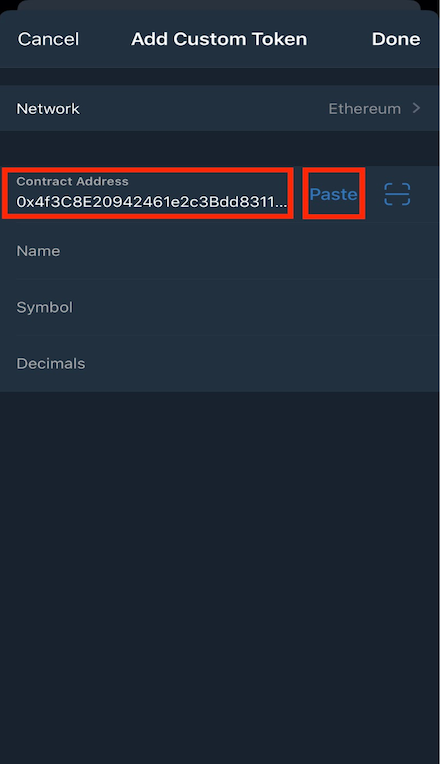
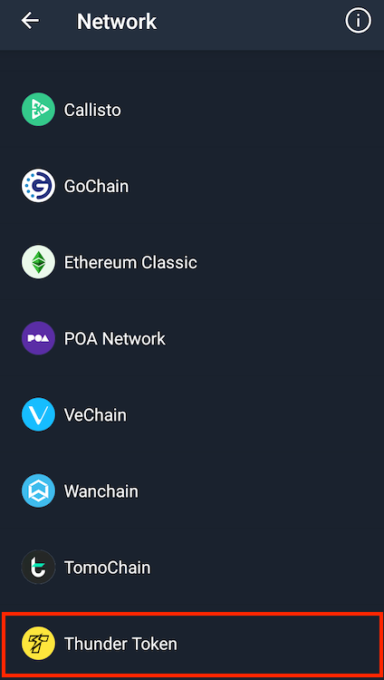

## 介绍
这里将向您展示如何将 TT-USDT 或 TT-DAI 添加到您的 Trust wallet。请注意，Trust wallet 是一款第三方钱包，如果对钱包有疑问，请直接与钱包提供商联系。

*TT-稳定币： TT-USDT, TT-DAI (了解 [更多](https://www.wikiwand.com/zh-cn/%E7%A8%B3%E5%AE%9A%E5%B8%81) 关于稳定币)*

## 将 TT-USDT 添加到 Trust wallet

1. 打开 Trust wallet，然后单击右上角的 `+` 

2. 在搜索栏中搜索 USDT 或任何文字，然后点击“添加自定义代币”

3. 请将网络从以太坊切换到 Thunder Token

4. 将 `0x4f3C8E20942461e2c3Bdd8311AC57B0c222f2b82` 复制到合约地址，然后将合约地址粘贴到栏位中 

5. 请在以下栏位中输入以下信息：

Item | Field
----- | -----
**Name** | USDT
**Symbol** | TT-USDT
**Decimals** | 6

## 将 TT-DAI 添加到 Trust wallet

1. 打开 Trust wallet，然后单击右上角的 `+` 

2. 在搜索栏中搜索 DAI 或任何文字，然后点击“添加自定义代币”

3. 请将网络从以太坊切换到 Thunder Token

4. 将 `0x2b31e3b88847f03c1335E99A0d1274A2c72059DE` 复制到合约地址，然后将合约地址粘贴到栏位中 

5. 请在以下栏位中输入以下信息：

Item | Field
----- | -----
**Name** | USDT
**Symbol** | TT-DAI
**Decimals** | 18

