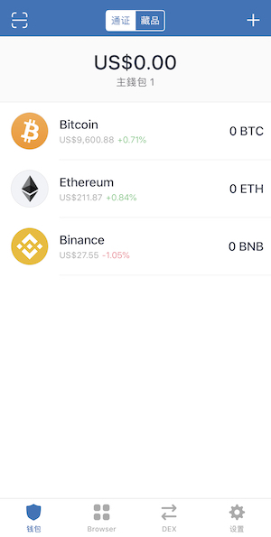

## 准备入门
为了使用 ThunderCore 区块链 (及其他大多数的区块链)，你将需要一个钱包地址，此地址的工作方式类似于信用卡号。
 
## Trust Wallet
Trust Wallet 是一款行动版的以太坊钱包，支持许多 ERC20、ERC223、ERC721代币，如以太坊、以太坊经典、Callisto 和 Thunder Token 等代币。目前 Trust Wallet 可以存取超过20,000个基于以太坊为基础的代币，同时 Trust Wallet 也是币安的官方用户加密钱包。
 
Thunder Token (TT) 已与 Trust Wallet 整合，因此你可以立即开始发送、接收和存储 Thunder Tokens (TT) 并使用 Thunder Token DApps！本教程将引导你轻易完成 Trust Wallet 设置并获取 Thunder Token。
 
在 Apple 的 App Store 或 Google Play 上搜索 “Trust Wallet”。

下载应用程序并设置 seed phrase 后，你只需将 Thunder Token (TT) 以代币添加至钱包中。  
 
### 开始使用 ThunderCore

#### 步骤1
点击钱包屏幕右上角的 `+` ，如下所示：

#### 步骤2
搜索 Thunder 并添加 Thunder Token 代币

恭喜！你已在 Trust Wallet 上设置了 ThunderCore 地址！
