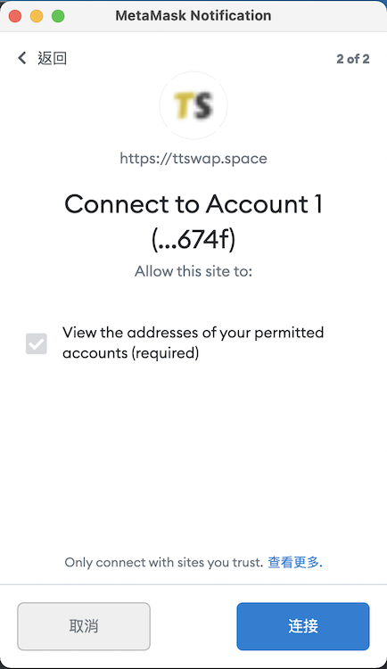
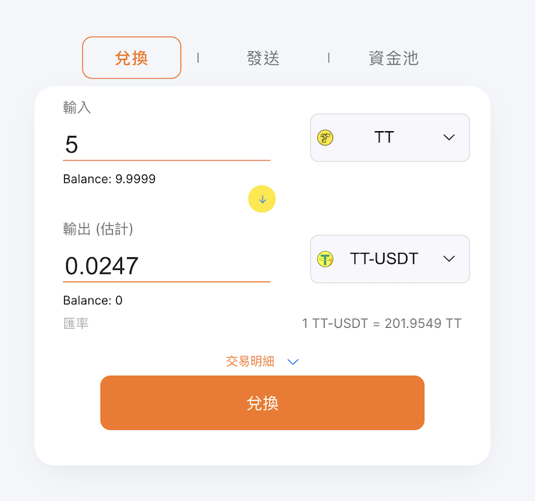
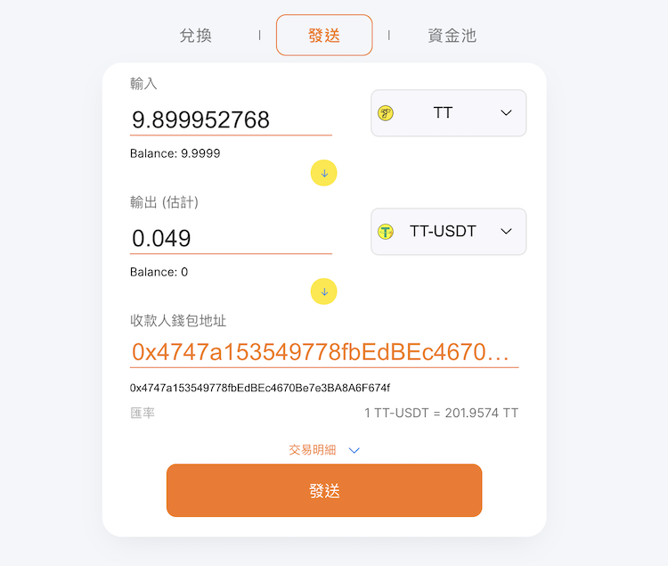
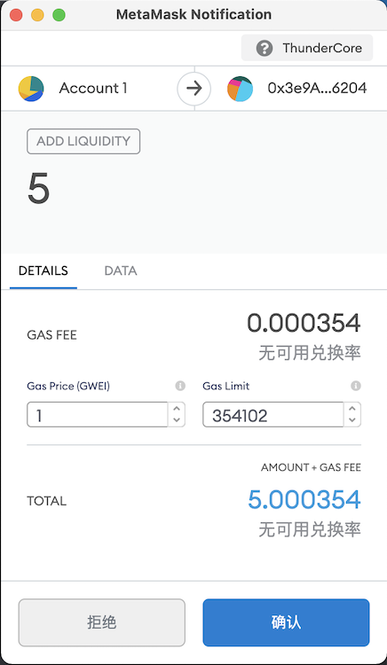
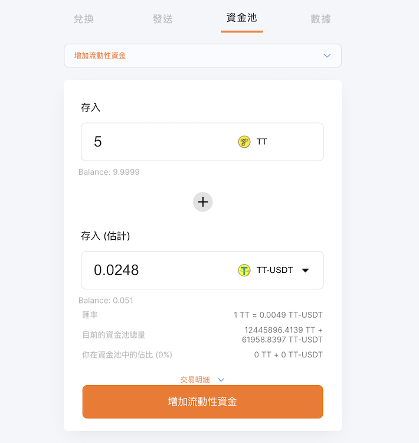
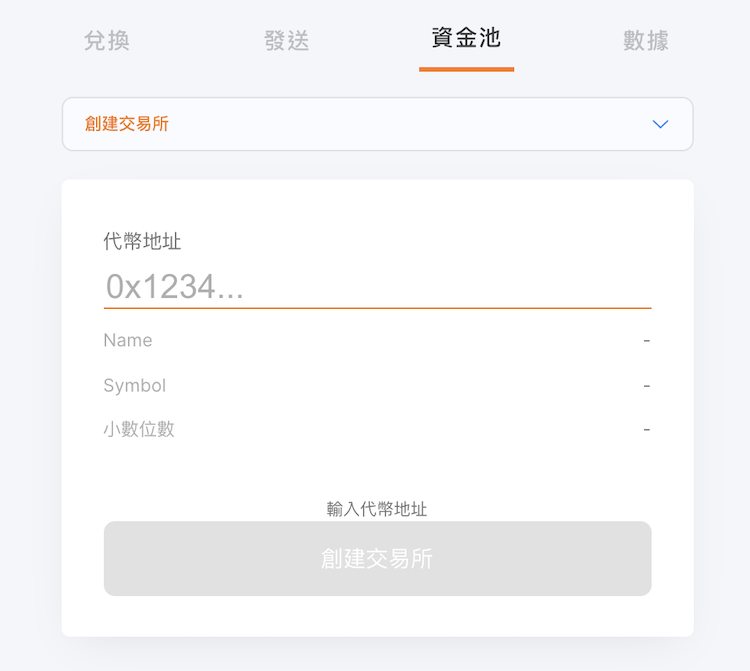
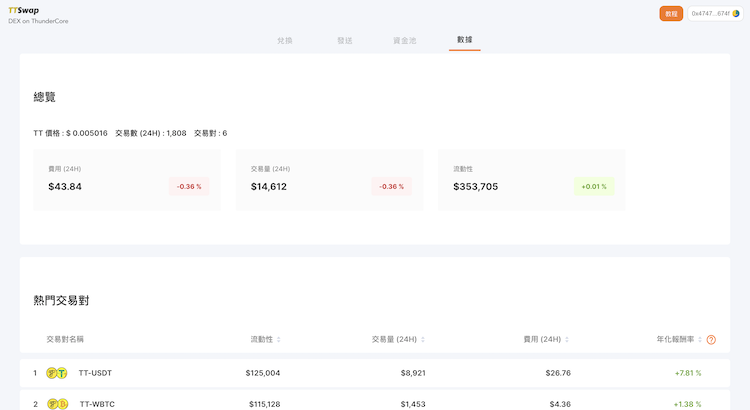

### TTSwap 是什么? 
TTSwap 是一个基于 Uniswap 开源协议并部署在 ThunderCore 上的分散式代币交换服务。 

## 为何要使用 TTSwap?
* TTSwap 是您快速利用 TT 获取 TT 链上稳定币 (TT-SAI 与 TT-USDT) 的方法。
* 作为 TT 链上的资金避风港，避免您的数位资产遭受过大的波动。
* 享受比以太坊更快速的体验，安全且快速地发送您的代币。

## 立即开始
当您使用移动设备时，请下载与以太坊兼容的应用程序内建浏览器以使用 TTSwap，并确保您已切换到 ThunderCore 主网以连接您的钱包。 

我们支持的钱包：
* [ThunderCore Hub](https://support-center.thundercore.com/docs/get-wallet/)
* Metamask
* Trust Wallet

NOTE
* _了解如何在 MetaMask 中设置 [ThunderCore Mainnet](https://support-center-cn.thundercore.com/docs/metamask/)_
* _了解如何在 Trust Wallet 中设置 [ThunderCore Mainnet](https://support-center-cn.thundercore.com/docs/trust-wallet/)_

### 主要特点
TTSwap Exchange 的当前功能分为 5 类：
1. 兑换 (Swap) 
2. 发送 (Send)
3. 添加/移除流动性 (Add/Remove Liquidity)
4. 创造交易所 (Create Exchange) 
5. 数据 (Stats)

## 如何使用 TTSwap? 
连接自己的钱包

## 步骤 1
使用 Web3 浏览器 (如 MetaMask) 打开 TTSwap Exchange 后，弹出窗口将要求您连接到您的钱包地址，如下所示：

## 步骤 2
要开始使用 TTSwap 上的所有服务，请单击 “Connect” 以继续。 

兑换
1. _"兑换”_ 是一种可以交换任何两种 ERC-20 代币的功能。

2. 在选择用于交换的输入和输出代币后，您可以选择在“输入”或“输出”空白之一中输入数字，另一侧空白将立即计算相应的数字。

	*如果您按下 “Balance:xxxxx”，TTSwap 将自动填写您的余额的最大数量 (将扣除余额的0.1)。

发送
1. “发送” 是一种可以在交换完成的同时将代币发送到另一个地址的功能。

2. 显示的数字已扣除手续交换费。

3. TTSwap 将为每笔 TT ⇄ TT稳定币交易收取 0.3％ 的费用。 (TT StableCoin ⇄ TT StableCoin 的交易将收取两次交易费用，总计 0.5991％) 此费用称为流动性提供者费用，该费用将支付给流动性提供者。 

添加/移除流动性
_请注意，此服务只能在您同意解锁按钮后使用。_

* 添加流动性
	*添加流动性将使您的 TT 和代币以 1：1 的比例存入 TTSwap 的合约中，以增加 TT-Token 交易对的流动性。*
	*您将可以在人们兑换代币期间，获得交换手续费的分润。*
	*当您在交易所完成流动性的增加时，您将收到資金池代币作为您在该资金池的权益证明。*

* 移除流动性
	*当您移除流动性时，您将销毁资金池代币并随之转出您应得的 TT 和代币，这其中包括上述交换手续费的分润。*
	*您只能移除 (提领) 您自己的资金池代币。*

## 创造交易所
要创建交易所，请填写 ERC-20 通证的地址，单击 “创建交易所” 以发送交易。经区块链上确认交易后，通证将能够在 TTSwap 上进行交易。

## 数据

1. _透过 “数据” 的页面，您可以参考最近交易数据包含：_ 

	* TT 价格
	* 交易对
	* 交易数 (24H)
	* 费用
	* 交易量 (24H)
	* 流动性
	* 热门交易对

_请注意：透过 “数据” 的页面，您可以参考添加流动性的年化报酬率。如果您想要了解更多关于怎么添加流动性，您可以参考“添加/移除流动性”_

