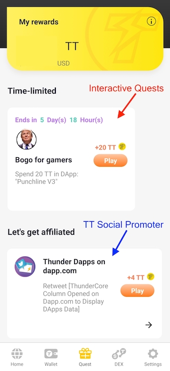

## What is ThunderCore Developer Jumpstart Program?

### *ThunderCore Developer Jumpstart Program directly funnels active crypto users to your decentralized applications*

In crypto, users are the most valuable asset. ThunderCore directs crypto users to your DApp and helps you with marketing while you are getting started.

The goal of the ThunderCore Developer Jumpstart Program is to get you through the first stage of developing your crypto DApp or building your startup. This means: help your team and your DApp to the point where you’ve built a product impressive enough to sustain itself, make a profit and even raise money on a larger scale.

## What do I get?

### *ThunderCore will bring at least 10,000 crypto users to your DApp, is your DApp ready for prime time?*

All successful DApps in crypto needs some combination of users and marketing. In our case, ThunderCore Developer Jumpstart Program gives you the unique opportunity to access both at the same time:

### **1. Interactive Quests: direct crypto user acquisition**

Through the **_Interactive Quests_** in the ThunderCore Hub Quest System, we **directly** incentivize our active user base(25k+ DAU), one of the largest in the entire crypto to visit your DApp and use certain functionalities. There is no better way to access crypto users than this, period.

We are so confident that we can funnel at least 10,000 crypto users to your DApp, and that confidence comes from the fact that ThunderCore has one of the largest active user bases in the entire crypto space, and you can see the success of existing DApps on ranking sites like [DappRadar](https://dappradar.com/rankings/protocol/thundercore) and [dapp.com](https://www.dapp.com/dapps/thundercore).

### **2. TT Social Promoter: unparalleled crypto marketing infrastructure**

Through the **_TT Social Promoter_** in the ThunderCore Hub Quest System, users are directly incentivized to help you promote your socials, for instance retweeting a tweet you posted. Users become affiliates and they will help you spread the word and kickstart the network effects. The news of the grand launch of your DApp will be the talk of the town in no time!

## How do I participate?

We want to learn about your project! Submit your application [here](https://forms.gle/8vcPhMKLSXGPxnJVA).

---
## Case study: How effective is it?
Punchline, a participant of the program wrote a blog post describing how ThunderCore Developer Jumpstart Program helped the Punchline app immensely: [Why Punchline has chosen ThunderCore not Ethereum](https://foxreymann.medium.com/why-punchline-has-chosen-thundercore-not-ethereum-f9a7679e9ba2).

Here's a brief summary of Punchline's journey:

1. **Development and submission**: Punchline was developed and [submitted to ThunderCore Hub](https://dapps.thundercore.com/submit).
2. **Testing and listing**: ThunderCore engineers do some testing to make sure the DApp works, then Punchline got listed on [ThunderCore Hub](https://www.thundercore.com/thundercore-hub/)!
3. **ThunderCore Hub promotions**
	* **Featured tab**: As Punchline reaches stability, it shows up under the *Featured* tab to ensure maximum visibility to the users
	* **New alert**: Punchline also get a *“New!”* alert next to its logo and shows up on the top of the list
	* **Banner promotion**: The banner that Punchline submitted in step 1 goes live in ThunderCore Hub, and tens of thousands of Daily Active Users can immediately see Punchline's banner upon opening ThunderCore Hub!

4. **See numbers moon with the Quest System** 🚀 

And recently, Punchline is already live on the Quest System with an [Interactive Quest](#1-interactive-quests-direct-crypto-user-acquisition) that incentivize users to try out the DApp, and that immediately lead to a huge influx of users for Punchline!

___