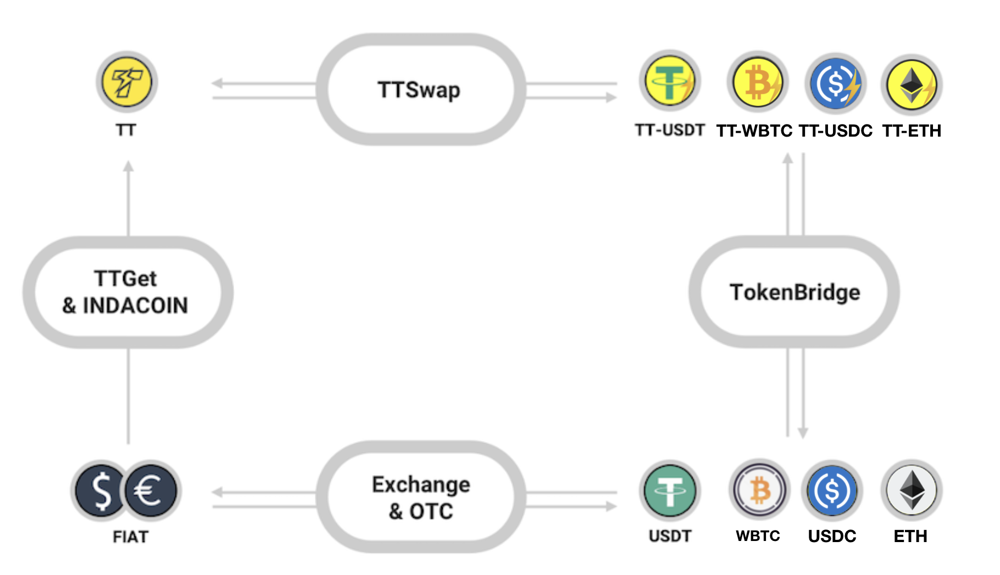

## Intro
There are different ways to get ERC-20 tokens on ThunderCore, you can find a way that suits you to enter ThunderCore and start to experience the ultra-fast and secure blockchain. 

## Landscape
Each line is bidirectional:

## Usage
_If you are a crypto holder or user_

* If you want to get some TT with USDT, BTC: 
  1. You can get your TT via [here](https://coinmarketcap.com/currencies/thunder-token/#markets) 
  2. Clicking on `Pair` will direct you to the trading pair for the exchange

* Convert your USDT/SAI to TT-StableCoin via [ThunderBridge](https://bridge.thundercore.com/)
  1. Refer to [ThunderBridge](https://bridge.thundercore.com/) and enable the Web3 wallet (such as MetaMask) to start 
  2. Input the amount of USDT/SAI you want to transfer 
  3. Wait for the block confirmation and then you will see the Success page if the transaction is complete 
  4. Check out the [Tutorial](https://docs.thundercore.com/docs/ThunderStableCoinTutorial.pdf) if you have other questions about [ThunderBridge](https://bridge.thundercore.com/)

* Exchange TT with TT-StableCoin via [TTSwap](https://ttswap.space/#/swap)
  1. Refer to [TTSwap](https://ttswap.space/#/swap) and enable the Web3 wallet (such as MetaMask) to start 
  2. Select the Input and Output of token to start the process  
  3. Wait for the process and you will get the tokens accordingly  
  4. Check out the [Tutorial](https://ttswap.space/TTswapTutorial.pdf) for more information

_If you don’t have any crypto_

* If you want to start exploring the ThunderCore ecosystem with TT, 
  1. [TTGet](https://indacoin.io/buy-thundertoken-with-card) - To get TT with credit card (supports Visa, Mastercard, and JCB) 
     * Refer to [TTGet](https://indacoin.io/buy-thundertoken-with-card) and enable the Web3 wallet (such as MetaMask) to start
     * Check out the `How to buy` to learn more about TTGet
     * Click `Buy now` will auto-connect with your MetaMask
     * Select the package that you want to purchase
     * Check out the [FAQ](https://ttget.appcenter.games/) if you have other questions about TTGet
  2. [IndaCoin](https://indacoin.io/buy-thundertoken-with-card) - To get TT with a credit card or debit card instantly (not available for locations such as the US, China, Japan, etc.)

* If you don’t have any TT or TT-StableCoin,
You can buy them via a crypto exchange (eg. Huobi, Upbit) or you can get them via OTC.

* If you would like to learn more about WBTC, feel free to check out more information [here](https://wbtc.network/).
