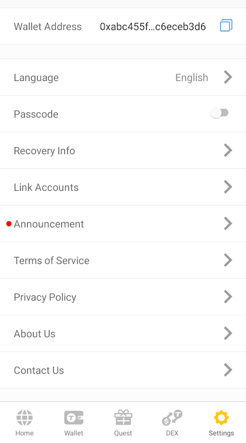
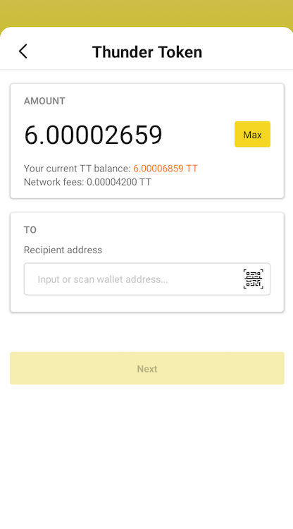
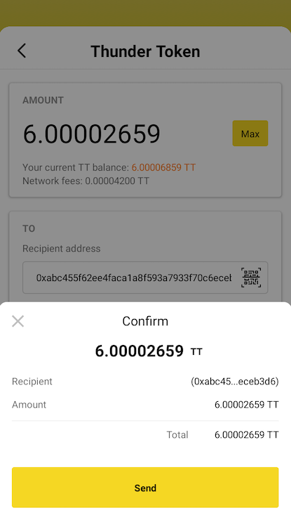
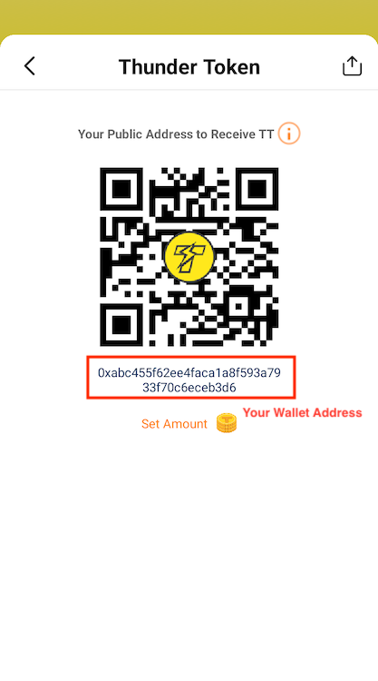
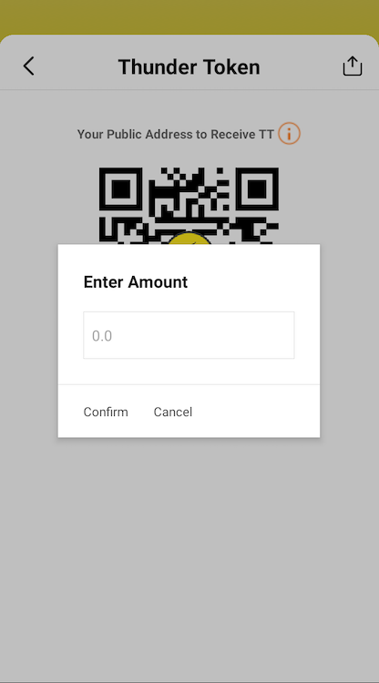
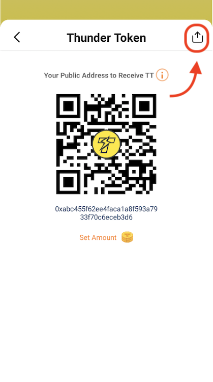

## Getting started
To use the ThunderCore blockchain (and most other blockchains) you'll need a wallet address. This address works similar to a credit card number.

## ThunderCore Hub

ThunderCore Hub is a secure and easy to use crypto wallet with full DApp browser capability.

### Install ThunderCore Hub
Download the ThunderCore Hub on [App Store](https://apps.apple.com/tw/app/thundercore-hub/id1471222243) or [Google Play](https://play.google.com/store/apps/details?id=com.thundercore.mobile) and follow the instructions below.

Check out [ThunderCore Hub](https://www.thundercore.com/thundercore-hub/) on ThunderCore official site.

### Overview about ThunderCore Hub
1. After opening the App, you can sign in to the wallet via 3 ways.

2. Then you will see the Home tab. You can enter the DApp or website URL in the search bar.

3. Click the Wallet tab, then you will see the Wallet page. This page will display the balance of your Thunder Token (TT) or TT20 tokens and all the transactions you make. Also, you can `Send` or `Receive` your TT  and `buy TT` via this page.

4. You can check out announcement, change your wallet language or set up the passcode on the Settings page.

### Features of ThunderCore Hub

#### Send token

 To send out token, click the `Send` button then you will see as below:

This page shows the balance of your TT. You can enter the address you want to send to in the field.

You can also send out your token to another address via QR code scanner.

Click `Send` to proceed if it is all correct.

#### Receive token

To receive token, click the `Receive` button then you will see as below:

You can set a amount if you want to receive a specific amount from another address.

The recipient will receive the same amount as you entered. 

 #### How to share my wallet address?
 
 Please go to receive page and click on the icon at the top right then you will see as below:
 
 
 
 Just copy it and paste to your note or wherever you want to.
