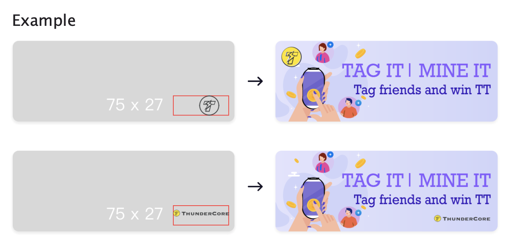

## DApp submit
You should follow this guideline before submitting your DApp to [TT-Radar](https://dapps.thundercore.com/submit).

## Cover The Carousel Banner Ad Size
The ThunderCore system will serve banner ad size across the platform. The main banner ad size is as follows:

Dimension: All standard dimensions font size:
* H1 24px.

* H216px

* H3 14px

* Do not use font sizes less than 14 px

* Format: Jpeg, jpg, PNG. 

* File Size: 297Wx108H 

**Please submit @2x file**

## APPS Logo
The APPS Logo requirements include:

* Format: Jpeg, jpg, PNG. 
* FileSize:64Wx64H 

**Please submit @2x file**

## Note
The content which is available through the Thundercore platform is owned by many different rights holders. If you use that content you must comply with the rules set out in our Developer Terms of Service.
If you use any ThunderCore metadata, it must always be accompanied by the Thundercore brand and links back to the ThunderCore Service as described in the Developer Terms.
If you incorporate any streaming functionality, this must also include clear ThunderCore branding and comply with the additional
limitations set out in the Developer Terms.
