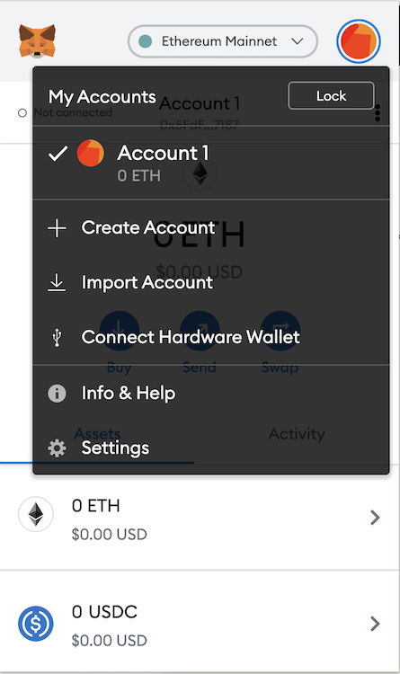
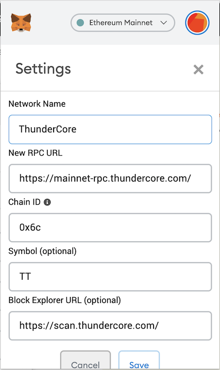

## Getting Started
To use the ThunderCore blockchain (and most other blockchains) you'll need a wallet address. This address works similar to a credit card number.

## MetaMask

MetaMask is a digital wallet that can be used to hold your Thunder Tokens. The following instructions show you how to enable MetaMask for use with the ThunderCore platform.
​
### Install MetaMask
Download the MetaMask Google Chrome plugin at https://metamask.io/ and follow the instructions below.
​
### Connect to ThunderCore
1. Start up MetaMask in your browser.
 

2. Click on the circular icon on the top right.

3. Click on `Settings` on the bottom of this window and scroll down to `Networks` to add a new network.

​

4. Scroll down again to click the button `Add Network`

​

5. In the next screen, enter the following information:

Field | Value
----- | -----
**Network name** | ThunderCore
**New RPC URL** | https://mainnet-rpc.thundercore.com
**ChainID** | 0x6c
**Symbol** | TT
**Block Explorer URL (optional)**| https://scan.thundercore.com

6. The MetaMask account information on the main screen will be updated once the Thunder Tokens are received.

7. Click on the X on the top right to return to the main screen.

​

8. Clicking on the account name just below the main address line will copy your address to the clipboard.
 
### ​​Known issues with MetaMask
 
Since MetaMask was originally developed for Ethereum, certain info displayed in MetaMask can be somewhat misleading when you are using it for the ThunderCore Mainnet. Notably, there are multiple places in the UI that uses ETH (ether) as the unit, when they are really referring to Thunder Tokens. By extension, the USD numbers are incorrect too, since they are computed using the price of ether.
