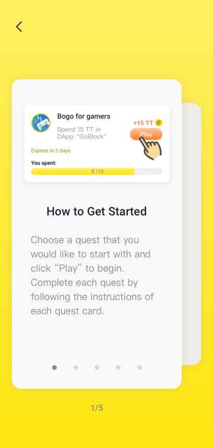
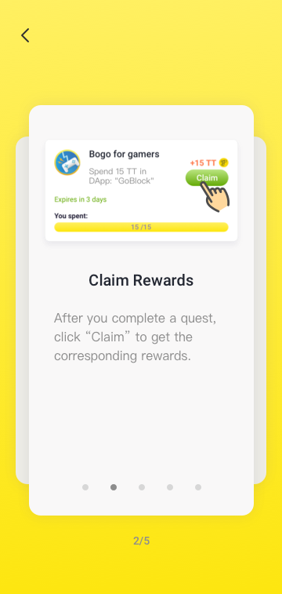
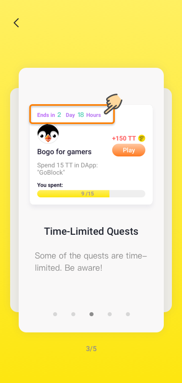
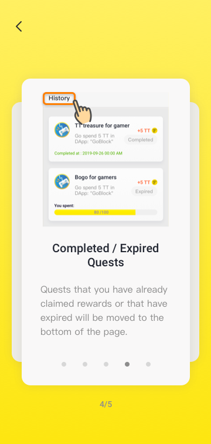
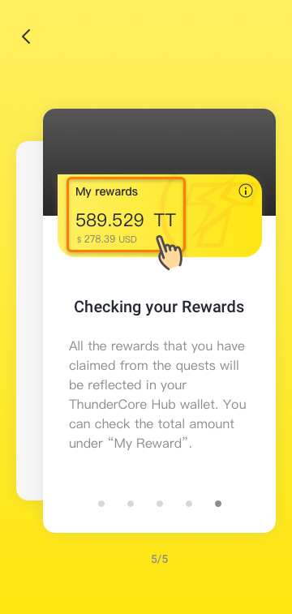

## 1. How to Get Started?
Choose a quest that you would like to start with and click "Play" to begin. Complete each quest by following the instructions of each quest card.

## 2. Claim Rewards
After you complete a quest, click "Claim" to get the corresponding rewards.

## 3. Time-Limited Quests
Some of the quests are time-limited. Be aware!

## 4. Completed / Expired Quests
Quests that you have already claimed rewards or that have expired will be moved to the bottom of the page.

## 5. Checking your Rewards
All the rewards that you have claimed from the quests will be reflected in your ThunderCore Hub wallet. You can check the total amount under "My Rewards".

