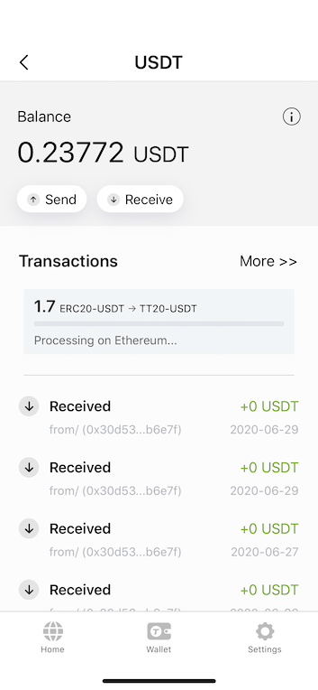
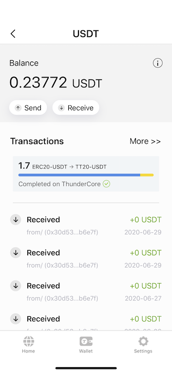
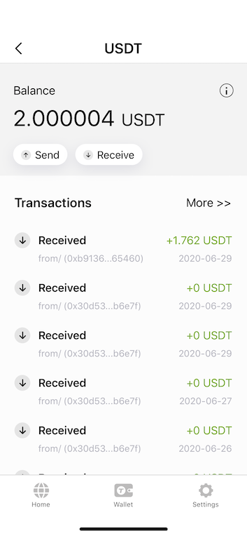
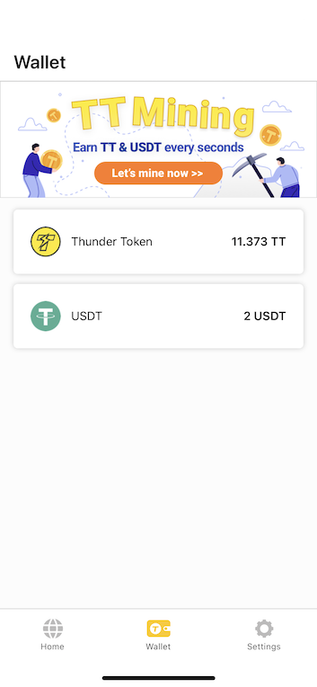
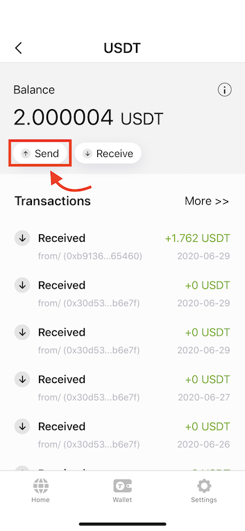
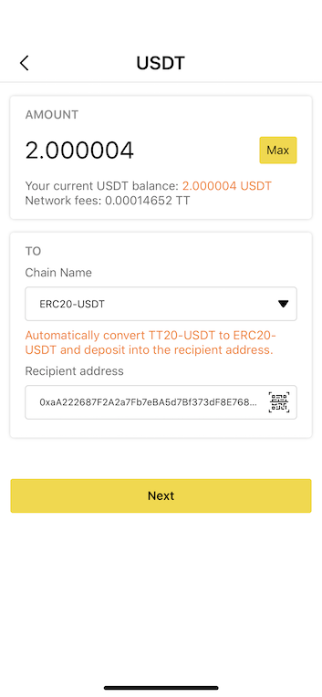
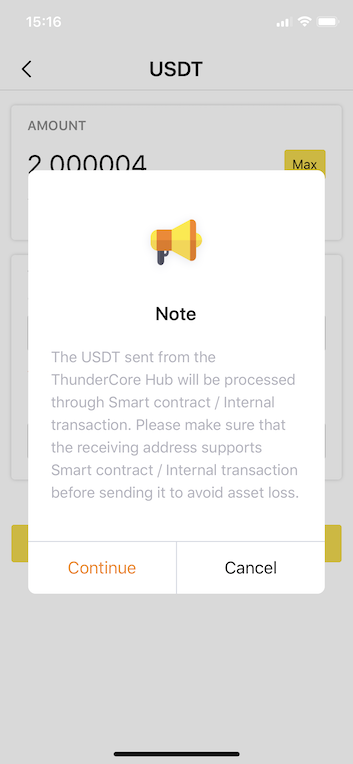
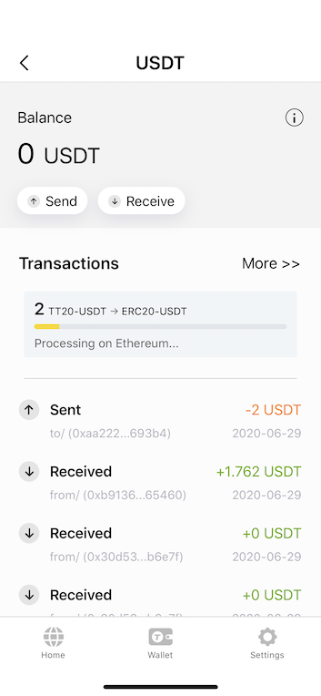
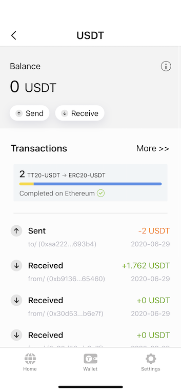

## Intro about TT20 stablecoin

In order to give our users a better experience of ThunderCore's ecosystem, when you use USDT to deposit into ThunderCore Hub, it will be automatically converted to TT20 stablecoin. **Please don't worry**, this process is reversible, and when you try to withdraw TT20 stablecoin to your other wallet, it will be converted back to USDT. 

## Deposit stablecoin from a 3rd party wallet to ThunderCore Hub 

1. After withdrawing your USDT from your 3rd party wallet, open ThunderCore Hub and go to the wallet tab then tap USDT and then you will see the transactions progress bar as shown below.

* This step may take a while due to the Ethereum network. 

2. Wait for the progress bar finish.

3. Once your transaction is completed, your screen should look like the one below

4. Check your wallet balance.

## Withdraw stablecoin from ThunderCore Hub to a 3rd party wallet  

1. Go to Wallet then tap USDT.

2. Press Send.

3. Enter the amount you want to send out and choose `ERC20-USDT` as Chain Name, then enter the Recipient's wallet address.

* Please choose the Chain Name carefully. This process cannot be reverted once the transaction is sent. 

4. Please read the Note carefully. 

5. Wait for the processing and you will see your transaction completed on Ethereum when it’s finished.

6. Your USDT has been sent out successfully. 

* If you want to check USDT transactions, please visit [Etherscan](https://etherscan.io/) rather than ThunderCore Scan (you cannot see the transaction record for internal transfer on ThunderCore Scan). 

