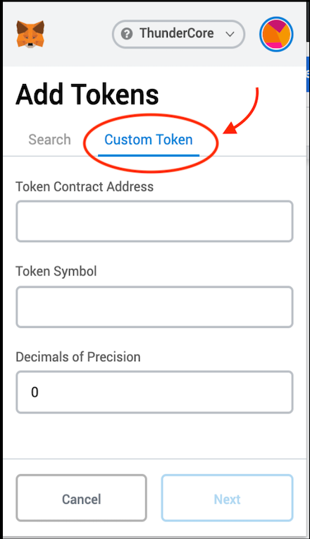
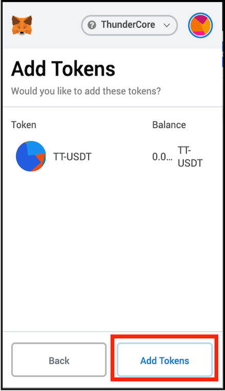

## Intro
Here’s a guide to show you how to add TT20-USDT to your MetaMask. Please note that MetaMask is a third party Web3 wallet, if you have questions about the wallet, please [contact](https://metamask.zendesk.com/hc/en-us) the wallet provider directly.

*TT20-StableCoin: TT20-USDT (learn [more](https://www.wikiwand.com/en/Stablecoin) about stablecoin)*

*If you want to know how to set up and use your MetaMask, please refer [here](https://developers.thundercore.com/docs/get-wallet/#metamask)*

## Add TT20-USDT to MetaMask

1. Open your MetaMask and make sure the Networks has switched to ThunderCore 

2. Click Menu 

3. Click Add Token

4. Select Custom Token in the tab 

5. Copy `0x4f3C8E20942461e2c3Bdd8311AC57B0c222f2b82` to the Token Contract Address and then the other blanks will be filled in automatically. Press Next to proceed

6. Press Add Tokens to proceed

7. Then you will see TT-USDT listed on your MetaMask

