## Intro
Here’s a guide to show you how to add TT20-USDT or TT20-SAI to your Trust Wallet. Please note that Trust Wallet is a third party wallet, if you have questions about the wallet, please contact the wallet provider directly.

*TT20-StableCoin: TT20-USDT, TT20-SAI (learn [more](https://www.wikiwand.com/en/Stablecoin) about stablecoin)*

## Add TT20-USDT to Trust Wallet

1. Open Trust Wallet and click on the “+” in the top right corner.

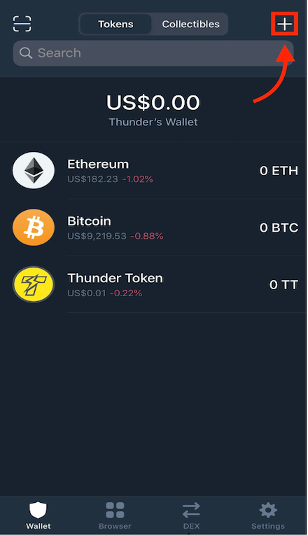

2. Search for USDT or any text in the search bar, then tap the “Add Custom Token”

3. Please switch the Network from Ethereum to Thunder Token

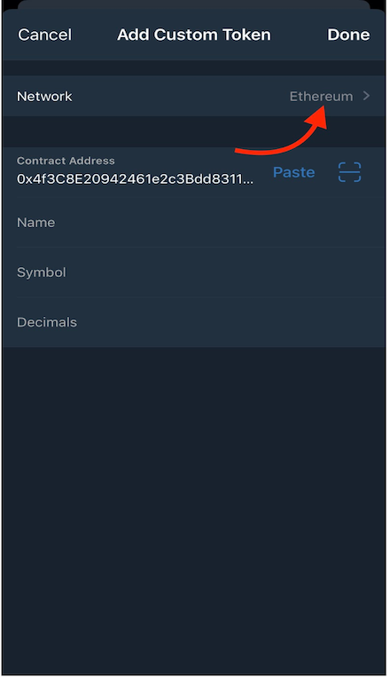

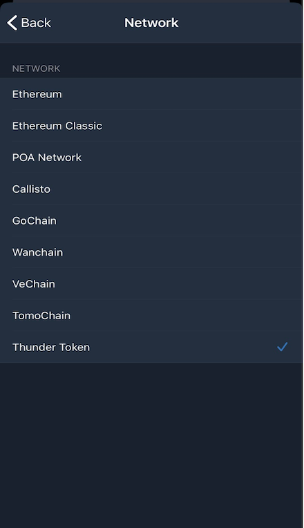

4. Copy `0x4f3C8E20942461e2c3Bdd8311AC57B0c222f2b82` to the contract address and then paste the contract address into the field 

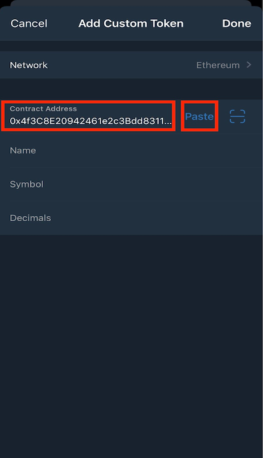

5. Please enter the following information to the fields as below:

Item | Field
----- | -----
**Name** | USDT
**Symbol** | TT-USDT
**Decimals** | 6

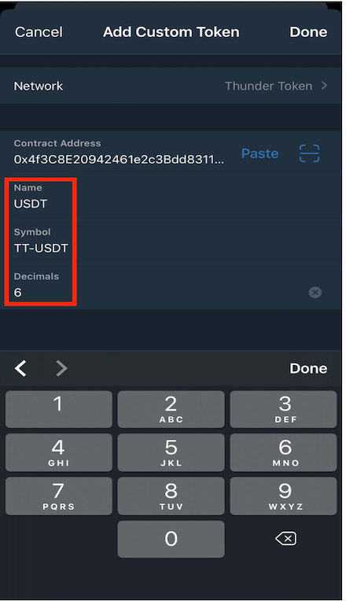

## Add TT20-SAI to Trust Wallet

1. Open Trust Wallet and click on the “+” in the top right corner 

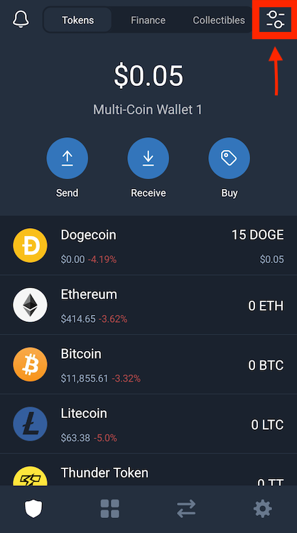

2. Search for SAI or any text in the search bar, then tap the “Add Custom Token” 

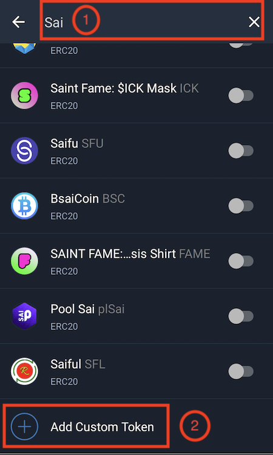

3. Please switch the Network from Ethereum to Thunder Token

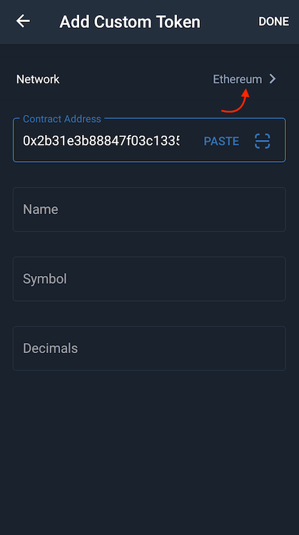

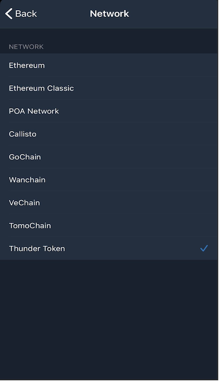

4. Copy `0x2b31e3b88847f03c1335E99A0d1274A2c72059DE` to the contract address then paste the contract address into the field

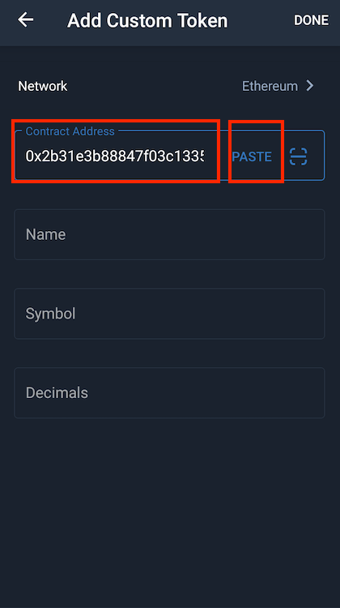

Item | Field
----- | -----
**Name** | TT-SAI
**Symbol** | TT-SAI
**Decimals** | 18

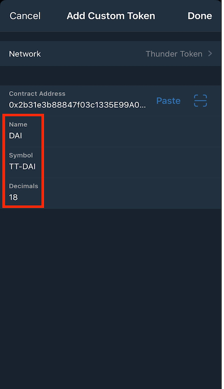
