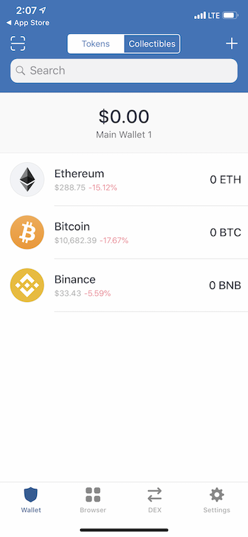
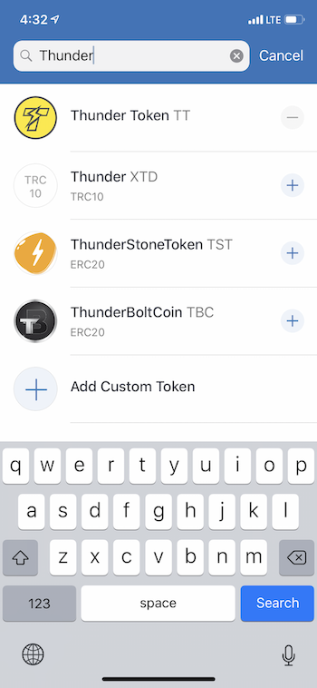

## Getting Started
To use the ThunderCore blockchain (and most other blockchains) you'll need a wallet address. This address works similar to a credit card number.
 
## Trust Wallet
Trust Wallet is a mobile Ethereum wallet that supports many ERC20, ERC223, ERC721 tokens, Ethereum, Ethereum Classic, Callisto and Thunder Token. Currently more than 20,000 tokens that are built on Ethereum are accessible through Trust Wallet. Trust Wallet is also Binance’s official user-controlled crypto wallet.
 
Thunder Token has integrated with Trust Wallet so that you can start to send, receive and store Thunder Tokens and use Thunder Token DApps today! This tutorial will walk you through the simple process of setting up Trust Wallet and claiming Thunder Tokens.
 
Search “Trust Wallet” on the Apple App Store or Google Play.

Once you have downloaded the app and set up your seed phrase, you just need to add Thunder Token as a token to your wallet.  
 
### Using ThunderCore

#### Step 1
Click on on the `+` on the top right of your wallet view as shown below

#### Step 2
Search for Thunder and add Thunder Token

Congratulations! You have set up a ThunderCore address on Trust Wallet!
