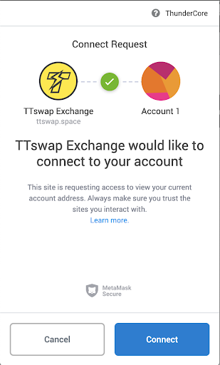
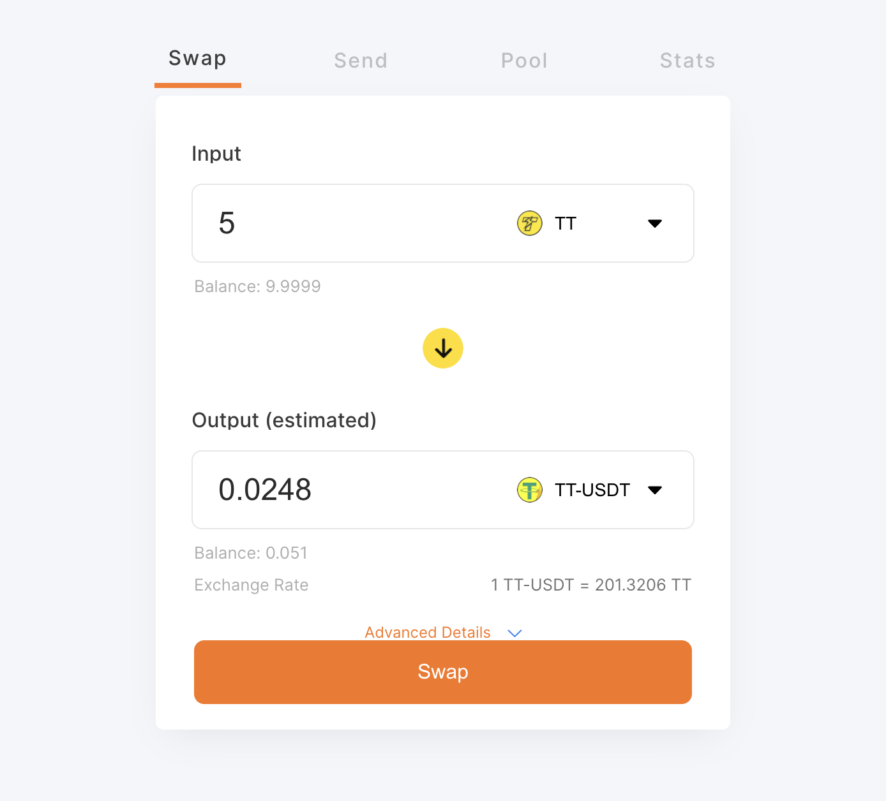
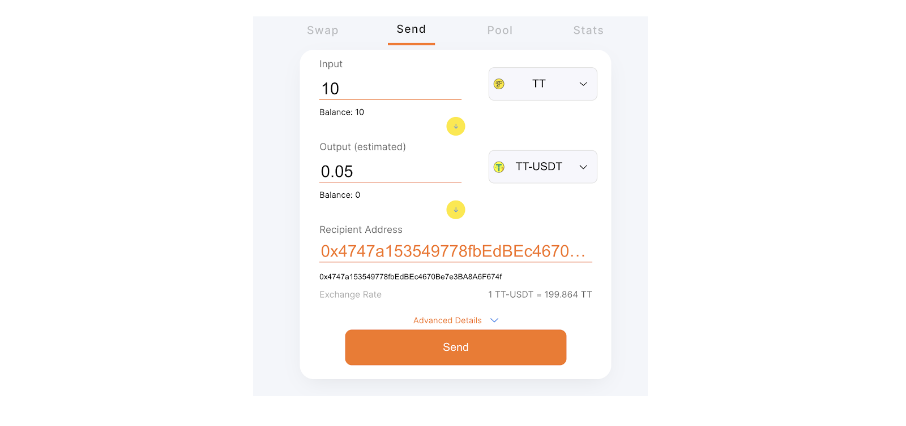
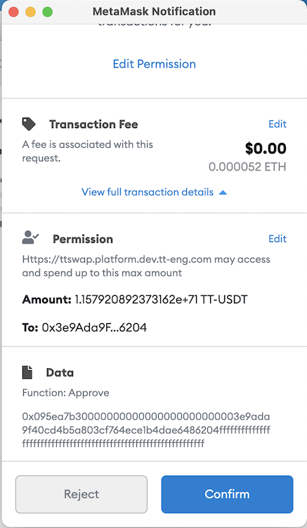
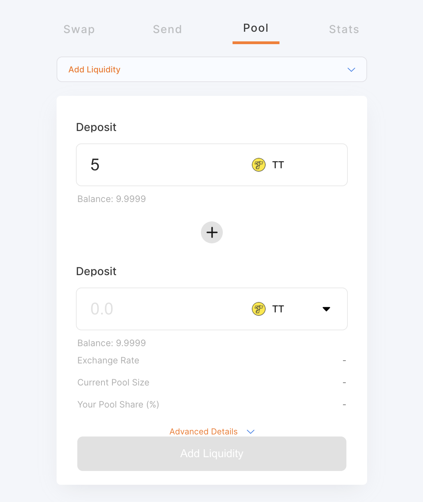
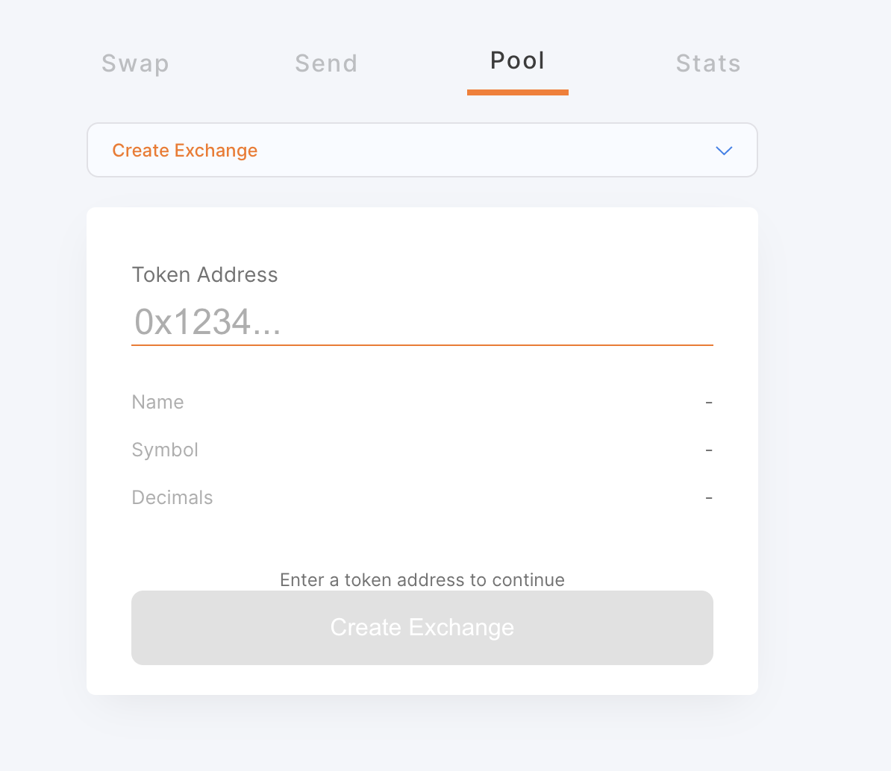
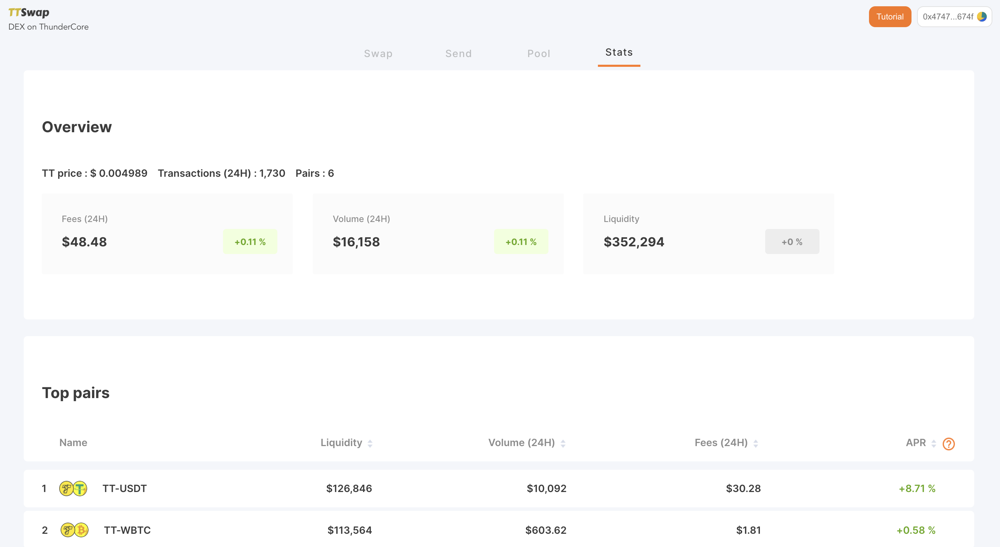

### What is TTSwap?
TTSwap is a decentralized token exchange service based on the Uniswap open-source protocol and deployed on ThunderCore. 

## Why use TTSwap?
* TTSwap is a fast way to convert your Thunder Token to TT-USDT/TT-USDC/TT-ETH/TT-WBTC on ThunderCore, and vice versa.
* As a safe haven on the ThunderCore blockchain, avoid undue fluctuations in your crypto assets.
* Enjoy a faster experience than Ethereum, allowing you to send your tokens safely and quickly.

## Get Started!
When using a mobile device, please download an In-App browser that is compatible with Ethereum to use TTSwap. And make sure that you have switched the network to the ThunderCore Mainnet to connect your wallet.

Please refer to our supported wallets:
* [ThunderCore Hub](https://support-center.thundercore.com/docs/get-wallet/)
* Metamask
* Trust Wallet

NOTE
* _Learn how to set up ThunderCore Mainnet in [MetaMask](https://support-center.thundercore.com/docs/metamask/)_
* _Learn how to set up ThunderCore Mainnet in [Trust Wallet](https://support-center.thundercore.com/docs/trust-wallet/)_

### Main Features
The current functions of the TTSwap Exchange can be divided into 5 categories:
1. Swap 
2. Send 
3. Add/Remove Liquidity 
4. Create Exchange 
5. Stats

## How to use TTSwap?
Connect your wallet

## Step 1
Once you open the TTSwap Exchange with a Web3 enabled browser (such as MetaMask), a pop-up will ask you to connect to your wallet address as shown below: 

## Step 2
To start using all services on TTSwap, please click Connect to proceed.

Swap
1. _“Swap”_ is a function that can exchange any two kinds of ERC-20 tokens.

2. After selecting the input and output token to exchange, you can choose to enter an amount in either the "Input" or "Output" blank, and the other blank will immediately calculate the corresponding amount.

* If you click on the “Balance: xxxxx”, TTSwap will automatically fill in the maximum amount based on your balance (0.1 of your balance would be deducted and reserved).

Send
1. “Send” is a function that allows you to send tokens to another address at the same time as the swap is completed.

2. The amount displayed has already deducted the exchange fee.

3. TTSwap will charge a 0.3% fee for each TT ⇄ TT StableCoin transaction. (TT StableCoin ⇄ TT StableCoin's transaction fee will be taken twice, a total of 0.5991%) This fee is called the liquidity provider fee which will be paid to the liquidity providers. 

_NOTE: When you use the Send function to swap and send, you will be swapping and sending tokens on the ThunderCore Network._

Add/Remove Liquidity
_Note: Please note that this service can only be used after you have agreed to unlock the button._

* Add Liquidity
	*Add Liquidity will put your TT and a Token pair in a 1:1 ratio to TTSwap's contract to increase liquidity for TT-Token trading pairs.*
	*You can get the profit when people pay the exchange fee during the deposit period.*
	*You will get the Pool Tokens as your proof of stake when you finish Add Liquidity in the exchange.*

* Remove Liquidity
	*When you Remove Liquidity, you will burn the Pool Tokens and in turn will receive the TT and Token you deserve. This amount will also include the aforementioned exchange fee profit.*
	*You can only remove (withdraw) your own Pool Tokens.*

## Create Exchange
To create exchange, please fill in the address of the ERC20 Token, click Create Exchange to send out the transaction. Token will be able to trade on TTSwap after the transaction is confirmed on the blockchain.

## Stats

1. _"Stats"_ is a page that you can utilize to look over the recent transaction data including: 

	* TT Price
	* Trading Pairs Available
	* Transactions (24HR)
	* Fees
	* Transaction Volume (24HR)
	* Liquidity
	* Top Trading Pairs

_Note: You may utilize the TTSwap “Stats” page to refer to the APR of adding liquidity to the liquidity pool. To learn about how to add liquidity, please refer to the add liquidity section under “Pool”._

