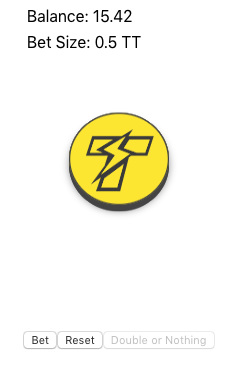

## Overview
Let's take 5-10 minutes and deploy a complete game powered by ThunderCore and accessible by your friends
and family - anyone with internet access. We will be launching a simple coin flip game
where the player gets double their bet if the coin lands face up. In the case that the coins lands face down, player loses their bet but will get the chance to double their bet.


## Exploring the Game
To begin, we will [obtain a wallet](get-wallet.md) and gain access to the Thunder network. With either [Metamask](https://metamask.io/) 
or [TrustWallet](https://trustwallet.com/) pointed to the Thunder RPC, navigate [here](http://jiang-yifan.github.io)
to see the game we will be building in this tutorial.




To make your own version of the page, just check out the [repo](https://github.com/jiang-yifan/jiang-yifan.github.io)
and follow the instructions in the readme.

At the end of those instructions, you should be able to access the game with either
your mobile device through Metamask or any ThunderCore compatible mobile DApp browsers.


## Deploying Your Own Contract
Now, let's get your game running on your own copy of the contract and get you started on your
path to millions.

First we will install all the dependencies.

```
cd ./smart-contracts
```
```
yarn install
# or 
npm install
```

Next grab your mnemonic from Metamask or Trust Wallet and add it to the HDWallet in `truffle-config.js`

```
yarn migrate --network thunder
# or 
npm run migrate --network thunder
```

In the console, you will see the price you've paid for its deployment, the contract address,
and additional stats. Well done! Your contract is now up and running ready to be used by anyone.

We must now update our UI to use this contract address.

```
cd ./frontend
```

```
yarn install
# or 
npm install
```

Find the `.env` file and change the `REACT_APP_CONTRACT_ADDRESS` to your new address.

```
yarn build
```

```
git add -u

*Remember to not check in your mnemonic!!!! 
``` 

```
git commit -m 'add my own contract address'
```

```
git push
```

Voila! In 5-10 seconds, your webpage will be running on your contract. Congratulations! 
