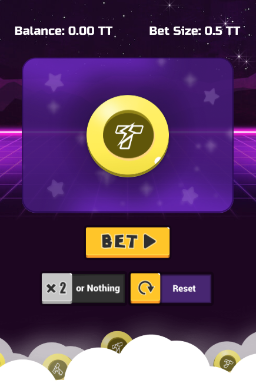

## Overview
Let's take 5-10 minutes and deploy a complete game that is powered by ThunderCore, and is accessible by your friends, family,and anyone with internet access! We will be launching a simple coin flip game where the player wins an equal amount to his or her bet if the coin lands face up. In the case that the coin lands face down, the player loses his or her bet, and is presented with the opportunity to double the previous bet.


## Exploring the Game
To begin, we will [obtain a wallet](get-wallet.md) and gain access to the Thunder network. With either [Metamask](https://metamask.io/) 
or [TrustWallet](https://trustwallet.com/) pointed to the Thunder RPC, [let's try out our game](http://jiang-yifan.github.io)!




To make your own version of the page, just check out the [repo](https://github.com/jiang-yifan/jiang-yifan.github.io) and follow the instructions in the readme.

At the end of those instructions, you should be able to access the game with either your mobile device through Metamask or any ThunderCore compatible mobile DApp browsers.


## Deploying Your Own Contract
Now, let's get your game running on your own copy of the contract, so you can get started developing your own killer DApp!

First we will install all the dependencies. 
```
node -v
# Lets make sure our node is v8 or v10
```
If your version is incompatible, install it with [HomeBrew](https://brew.sh/), 
```
brew install node@10
```
or go to [Node.js](https://nodejs.org/en/download/package-manager/) to install the correct version.


```
cd ./smart-contracts
```
```
yarn install
# or 
npm install
```

Next grab your mnemonic from Metamask or Trust Wallet and add it to the HDWallet in `truffle-config.js`

```
yarn migrate --network thunder --reset
# or 
npm run migrate -- --network thunder --reset
```

In the console, you will see the price you've paid for its deployment, the contract address, and additional stats. Well done! Your contract is now up and running ready to be used by anyone.

We must now update our UI to use this contract address.

```
cd ./frontend
```

```
yarn install
# or 
npm install
```

Find the `.env` file and change the `REACT_APP_CONTRACT_ADDRESS` to your new address.
```
yarn start
# or
npm run start
```
This will start a local server with your changes.

If you want to deploy this to your webpage run:

```
yarn build
# or 
npm run build
```

```
git add -u

*Remember to not check in your mnemonic!!!! 
``` 

```
git commit -m 'add my own contract address'
```

```
git push
```

Voila! In 5-10 seconds, your webpage will be running on your contract. Congratulations! 
