## Getting started
To use the ThunderCore blockchain (and most other blockchains) you'll need a wallet address. This address works similar to a credit card number.

## ThunderCore Hub

ThunderCore Hub is a secure and easy to use crypto wallet with full Dapp browser capability.

### Install ThunerCore Hub
Download the ThunderCore Hub on [App Store](https://apps.apple.com/tw/app/thundercore-hub/id1471222243) or [Google Play](https://play.google.com/store/apps/details?id=com.thundercore.mobile) and follow the instructions below.

### Overview about ThunderCore Hub
1. After open the App, you can sign in the wallet via 3 ways.

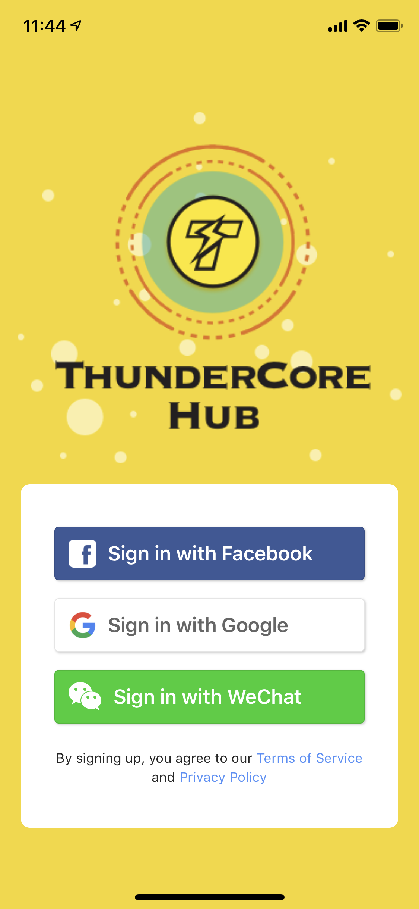

2. Then you will see the Browser page. You can enter the DApp or website URL in the search bar.

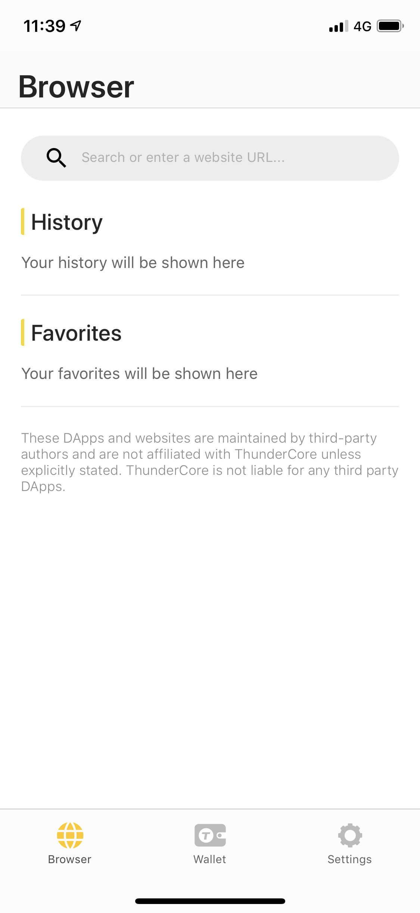

3. Click the Wallet tab, then you will see the Wallet page. This page will display the balance of your Thunder Token (TT) and all the transactions you made. Also, you can send or receive your TT  and buy TT via this page.

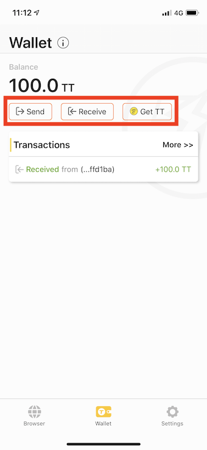

### Send/Receive token

To send out token, click the `Send` button then you will see as below:

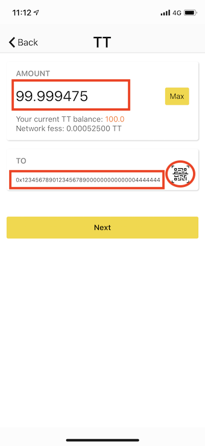

You can also use the scanner to scan another QR code to send out your token.
If it's all correct, click `Confirm` to proceed.

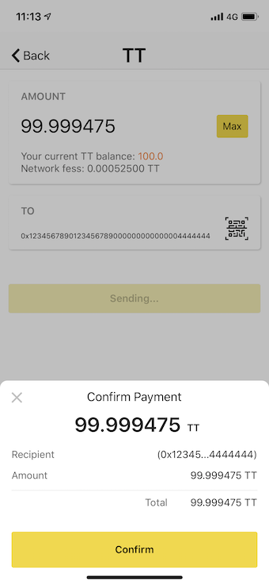

To receive token, click the `Receive` button then you will see as below:

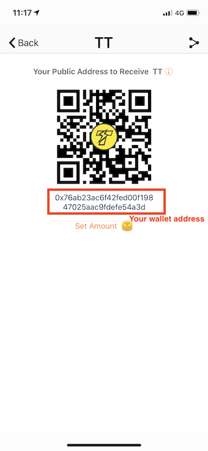

You can also set a amount if you want to receive a specific amount from another address:

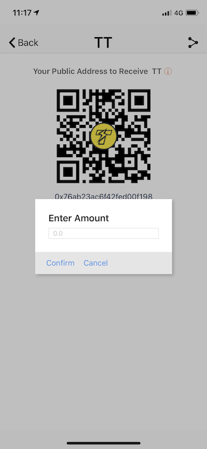

 ### Buy Thunder Token 
 
 If you don't have any Thunder Token (TT). [Try get some](https://www.appcenter.games/ttget) now.
 
 ### Where is my wallet address?
 
 Please go to receive page and click on the icon at the top right then you will see as below:
 
 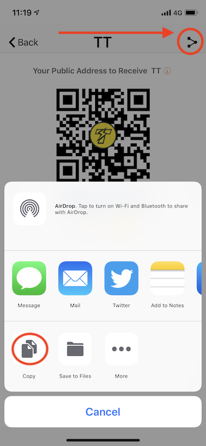
 
 Just copy it and paste to your note or whereever you want to.

5. You can contact us or Log out on the Settings page.

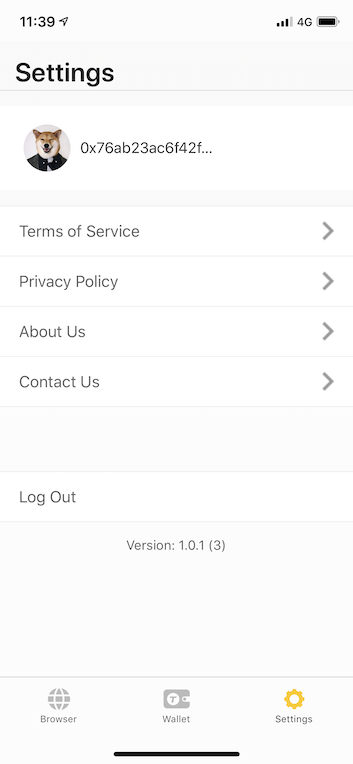

## MetaMask

MetaMask is a digital wallet that can be used to hold your Thunder Tokens. The following instructions show you how to enable MetaMask for use with the ThunderCore platform.
​
### Install MetaMask
Download the MetaMask Google Chrome plugin at https://metamask.io/ and follow the instructions below.
​
### Connect to ThunderCore
1. Start up MetaMask in your browser.
 

2. Click on the circular icon on the top right.

3. Click on `Settings` on the bottom of this window and scroll down to `Networks` to add a new network.

​

4. Scroll down again to click the button `Add Network`

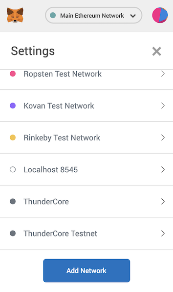​

5. In the next screen, enter the following information

Field | Value
----- | -----
**Network name** | ThunderCore
**New RPC URL** | https://mainnet-rpc.thundercore.com
**ChainID** | 108
**Symbol** | TT

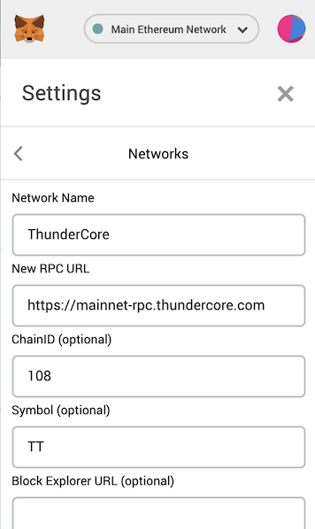
​
6. The MetaMask account information on the main screen will be updated once the Thunder Tokens are received. 
​
7. Click on the X on the top right to return to the main screen.

​
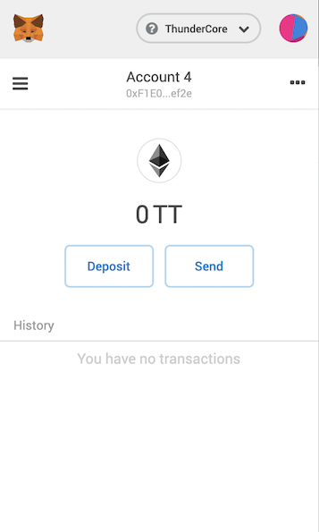

8. Clicking on the account name just below the main address line will copy your address to the clipboard.
 
### ​​Known issues with MetaMask
 
Since MetaMask was originally developed for Ethereum, certain info displayed in MetaMask can be somewhat misleading when you are using it for the ThunderCore Mainnet. Notably, there are multiple places in the UI that uses ETH (ether) as the unit, when they are really referring to Thunder Tokens. By extension, the USD numbers are incorrect too, since they are computed using the price of ether.

## Ledger Nano S
This guide will help you set up Hardware Wallet Support for the Ledger Nano S.
​
### Set up your Ledger

1. Create or synchronize a wallet on Ethereum Mainnet to Ledger Nano S.
	- Skip this step if you already have a Ethereum wallet on Ledger Nano S.
2. Connect your Ledger to your computer.
3. Open the Ethereum Application.  If the Ethereum Application is not installed:
 	- Visit https://www.ledger.com/pages/ledger-live to install Ledger Live on your computer.
 	- Install the Ethereum Application to your Ledger Nano S from the Ledger Live app.  Make sure contract data is turned on.
4. Open MetaMask.
5. Follow the instructions in this [well-written guide](https://medium.com/menlo-one/how-to-connect-your-ledger-nano-s-to-metamask-fa92402a0ed1) to connect your ledger to MetaMask.
 
### Connect to ThunderCore

Now that you've connected MetaMask to your Ledger wallet, follow the instructions under the MetaMask section above to connect to the ThunderCore network.
​
## Trust Wallet
Trust Wallet is a mobile Ethereum wallet that supports many ERC20, ERC223, ERC721 tokens, Ethereum, Ethereum Classic, Callisto and Thunder Token. Currently more than 20,000 tokens that are built on Ethereum are accessible through Trust Wallet. Trust Wallet is also Binance’s official user-controlled crypto wallet.
 
Thunder Token has integrated with Trust Wallet so that you can start to send, receive and store Thunder Tokens and use Thunder Token DApps today! This tutorial will walk you through the simple process of setting up Trust Wallet and claiming Thunder Tokens.
 
Search “Trust Wallet” on the Apple App Store or Google Play.

Once you have downloaded the app and set up your seed phrase, you just need to add Thunder Token as a token to your wallet.  
 
### Using ThunderCore

#### Step 1
Click on on the `+` on the top right of your wallet view as shown below

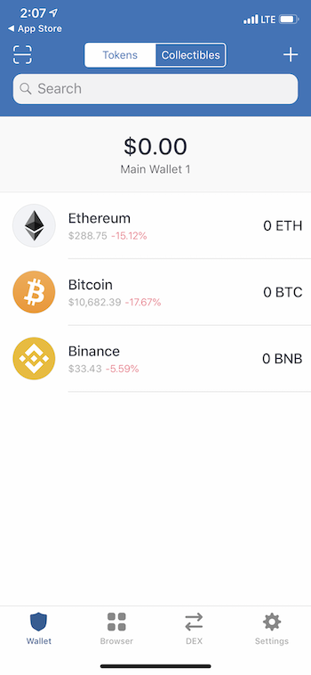

#### Step 2
Search for Thunder and add Thunder Token

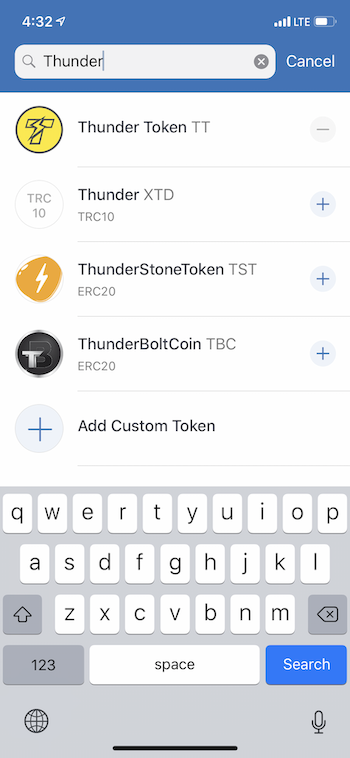

Congratulations! You have set up a ThunderCore address on Trust Wallet!
