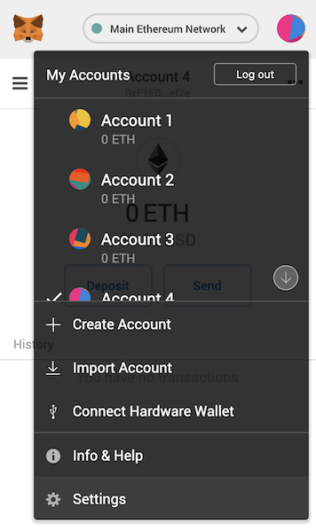
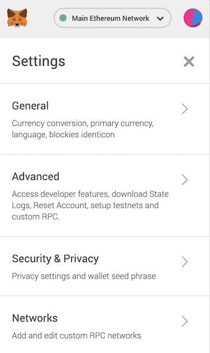

## Getting started
To use the ThunderCore blockchain (and most other block chains) you'll need a wallet address. This address works similar to a credit card number.

## MetaMask

MetaMask is a digital wallet that can be used to hold your Thunder Tokens. The following instructions show you how to enable MetaMask for use with the ThunderCore platform.
​
### Install MetaMask
Download the MetaMask Google Chrome plugin at https://metamask.io/. You will need your password and the seed words (make sure you save them in a secure location!).
​
### Connect to ThunderCore
1. Start up MetaMask in your browser.
 

​
2. Click on the circular icon on the top right (your screen may have a different icon, however it will work the same way). It will open a My Accounts window.
​
3. Click on Settings on the bottom of this window and scroll down to New Network.  Click on "Show Advanced Options",  In the dialogue box enter the url for the ThunderCore Mainnet is:
"https://mainnet-rpc.thundercore.com", for chain ID enter "108", and for symbol type "TT".  To be entered as shown below.

​
​
4. The MetaMask account information on the main screen will be updated once the Thunder Tokens are received. 
​
5. Click on the X on the top right of the My Account screen to see the number of tokens in the account. 
​
6. Clicking on the account name just below the main address line will copy your address to the clip board.  You can paste this into your email window or any other document.
​

 
### ​​Known issues with MetaMask
 
Since MetaMask was originally developed for Ethereum, certain info displayed in MetaMask can be somewhat misleading when you are using it for the ThunderCore Mainnet. Notably, there are multiple places in the UI that uses ETH (ether) as the unit, when they are really referring to Thunder Tokens. By extension, the USD numbers are incorrect too, since they are computed using the price of ether.

## Ledger Nano S
This guide will help you set up Hardware Wallet Support for the Ledger Nano S.
​
### Set up your Ledger

1. Create or synchronize a wallet on Ethereum Mainnet to Ledger Nano S.
	- Skip this step if you already have a Ethereum wallet on Ledger Nano S.
2. Connect your Ledger to your computer.
3. Open the Ethereum Application.  If the Ethereum Application is not installed:
 	- Visit https://www.ledger.com/pages/ledger-live to install Ledger Live on your computer.
 	- Install the Ethereum Application to your Ledger Nano S from the Ledger Live app.  Make sure contract data is turned on.
4. Open MetaMask.
5. Follow the instructions in this [well-written guide](https://medium.com/menlo-one/how-to-connect-your-ledger-nano-s-to-metamask-fa92402a0ed1) to connect your ledger to MetaMask.
 
### Connect to ThunderCore

Now that you've connected MetaMask to your Ledger wallet, follow the instructions under the MetaMask section above to connect to the ThunderCore network.

## MyEtherWallet
MyEtherWallet is a free and easy-to-use client-side interface that allows you to interact with your crypto-assets. This section will discuss three ways to access your Thunder Tokens:
​
1. Ledger
2. Keystore
3. Private Key
​
### Using Ledger with MyEtherWallet
 
#### Step 1
 
First unlock your ledger device, then go to www.myetherwallt.com and click “Access My Wallet”
​
#### Step 2
 
Choose Hardware

#### Step 3
 
Select “Ledger”, then click “Choose a Hardware”

#### Step 4
​
From the dropdown menu, Click “Add Custom Path”

#### Step 5^
​
Name this new path (eg Thunder Ledger), and enter the following in the Path field:
m/44'/60'/0'/0
 
#### Step 5^^
 
The above Path is for accessing Ethereum Addresses that hold Thunder Tokens.
If you are using Thunder Token derived addresses (eg the TT App in Ledger), then you must enter this path instead:
m/44'/1001'/0'/0
Then click “Add Custom Path”:

#### Step 6
​
From the HD Derivation Path dropdown, your new path should now be listed. Select it, then choose which account to interact with.
​

#### Step 7
​
Once the Wallet is open, Click “Change” under the Network section (top right) to confirm the Network Connection

#### Step 8
 
Scroll down and Select “ThunderCore”. The “ThunderCore” text is selectable:

### Your MyEtherWallet Keystore File
You must first have created MEW account and saved the UTC file to your computer. To access it once again:
​
#### Step 1
 
Go to www.myetherwallet.com and click “Access My Wallet”

#### Step 2
 
Click “Software”

#### Step 3
 
Select “Keystore File”, then click “Continue”. A dialog will open to your internal system’s files. Navigate to the folder containing your UTC file and open it.

#### Step 4
 
Enter the password you used to create the My Ether Wallet originally:

#### Step 5
 
Once the Wallet is open, Click “Change” under the Network section (top right) to confirm the Network Connection

#### Step 6
 
Scroll down and Select “ThunderCore”. The “ThunderCore” text is selectable:

### Your Private Key
In order to use your private key, you must first save it. Once you have created a My Ether Wallet for the first time, click the “Print” icon that is located just below the wallet Address:

A dialog will pop up displaying your wallet information, including your private key.
Save this Private Key.
When accessing this wallet in the future, you only need to:
​
1. Go to www.myetherwallet.com
2. Click “Access My Wallet”
3. Click “Software”
4. Select “Private Key”
5. Enter the Private Key that you saved, then click “Continue
6. Once the Wallet is open, Click “Change” under the Network section (top right) to confirm the Network Connection
7. Scroll down and Select “ThunderCore”. The “ThunderCore” text is selectable:

## Trust Wallet
Trust Wallet is the premier mobile ethereum wallet that supports main blockchains in the Ethereum ecosystem: any ERC20, ERC223, ERC721 tokens, Ethereum, Ethereum Classic, Callisto and Thunder Tokens. Currently more than 20,000 tokens that are built on Ethereum are accessible through Trust Wallet app. Trust Wallet is also Binance’s official user-controlled crypto wallet.
 
Now Thunder Token has integrated with Trust Wallet so that you can start to send, receive and store Thunder Tokens and use Thunder Tokens dApps today! This tutorial will walk you through the simple process of setting up Trust Wallet and claiming Thunder Tokens.{
 
Search “Trust Wallet” on the Apple App Store or Google Play:​

Once you have downloaded the app, you can follow the following simple steps to start to send and receive your Thunder Tokens on Trust Wallet:
 
### Using ThunderCore

#### Step 1
Click on “Create a new wallet”

#### Step 2
Back up your 12 words recovery phrase.

and then verify it.

Once you successfully verified the recovery phrase, your new wallet will be created.

#### Step 3
Next, you will see the default screen as shown below. Now you are ready to add Thunder Tokens to the main screen by tapping on the search magnifying glass on the top right corner.

Scroll down the list of cryptocurrencies to find Thunder Token and tap the plus sign:

Once you add Thunder Tokens to your Trust Wallet, you are ready to claim 50 free TT!

Once you have successfully added Thunder Tokens to your wallet, you will see 50 TT added to your wallet.

#### Step 4
Now you are ready to receive or send TT by tapping on Thunder Token icon on the Wallet screen.

In order to receive TT, you can just share your wallet address with senders.

To send TT, you can first tap on Send button. You need to put in the receiver wallet address and the amount of TT to send.

Then a confirmation screen will be displayed. Once you confirm the wallet addresses and amount to send, click on the Send button.

Once you have successfully sent TT, you will see the transaction on Thunder Token wallet screen:

