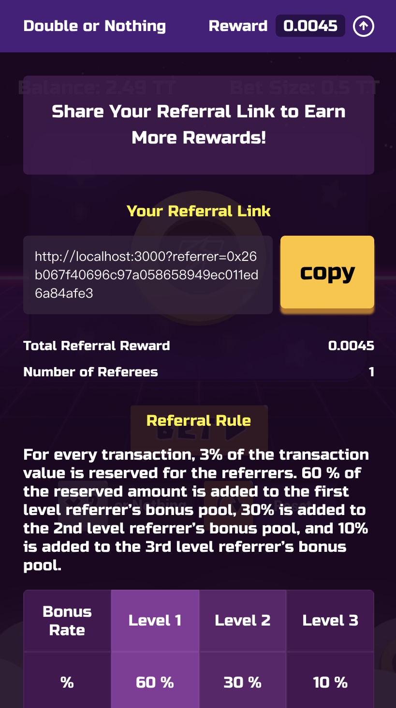

Referral is one of the best effective marketing. Lots of popular dapps, including, [Fomo3d](https://exitscam.me/), [My Crypto Heroes](https://www.mycryptoheroes.net), [HyperSnake](https://www.hypersnakes.io/e/e/d/index.html)..., use referral mechanisms to drive success.

Hence, we build a referral library, [Referral Solidity](https://github.com/thundercore/referral-solidity), in order to help dapps developers to quickly build their own referral mechanisms. In this document we will share how to use our library. We have also integrated referral to our tutorial [demo](https://thundercore.github.io/DoubleOrNothing).

## Referral Solidity Library

Check out our basic multi-level referral: [https://github.com/thundercore/referral-solidity/](https://github.com/thundercore/referral-solidity/). With this library, you can have the following features in minutes:

- Up to three levels referral system with native token (ETH, TT...)
- Pay referral bonus base referee amount
- Pay instantly when downline joins
- Only active user will get referral bonus

### How to Use

First, install our library with the following command.

```bash
npm install @thundercore/referral-solidity
```

Then, integrate referral solidity with your dapp by importing, initializing, binding referral relationship with `addReferrer` function and trigger referral payment by `payReferral`.

```solidity
pragma solidity ^0.5.0;
import '@thundercore/referral-solidity/contracts/Referral.sol';

contracts YourGame is Referral {
  // Referral(decimals, referralBonus, secondsUntilInactive, onlyRewardActiveReferrers, levelRate, refereeBonusRateMap)
  constructor() Referral (10000, 500, 1 days, true, [6000, 3000, 1000], [1, 10000]) public {
  }

  // bind uplineAddr as msg.sender's referrer
  function addUpline(address payable uplineAddr) public {
    addReferrer(upline);
  }

  // trigger pay referral in your business logic
  function play() public payable {
    payReferral(msg.value);
  }
}
```

In the line of `constructor() Referral (10000, 500, 1 days, true, [6000, 3000, 1000], [1, 10000])`, you might be confused what are those paramters mean. Pleasee see the explanation for the parameters below:

```solidity
Referral(decimals, referralBonus, secondsUntilInactive, onlyRewardActiveReferrers, levelRate, refereeBonusRateMap)
```

##### decimals `<uint>`

Base decimals for all rate calculation in referral.
For example, if `decimals` equals to `10000`, and `referralBonus` is `500`, that means referral bonus rate is `5%`.

##### referralBonus `<uint>`

The total referral bonus rate, which will divide by `decimals`. For example, If you will like to set a rate of `5%`, then set `referralBonus` as `50` when `decimals` is `1000`.

##### secondsUntilInactive `<uint>`

How long, in seconds, a user will be inactive. For example, `one days`.

##### onlyRewardActiveReferrers `<bool>`

The flag to enable whether not to pay inactive uplines.

##### levelRate `<uint[]>`

The bonus rate for each level, which will divide by decimals. The max level depth is 3. For example, set `levelRate` as `[6000, 3000, 1000]` when `decimals` is `10000` for the following case:

|      | level1 | level2 | level3 |
| ---- | ------ | ------ | ------ |
| Rate | 60%    | 30%    | 10%    |

##### refereeBonusRateMap `<uint[]>`

The bonus rate mapping to each referree amount, which will divide by decimals too. The max depth is 3.
The map should be pass as [ `<lower amount>`, `<rate>`, ... ]. For example, you should pass `[1, 2500, 5, 5000, 10, 10000]` when decimals is `10000` for the following case:

|      | 1 - 4 | 5 - 9 | 10+  |
| ---- | ----- | ----- | ---- |
| Rate | 25%   | 50%   | 100% |

That's see a real example for more clarity.

## Example - integrate to double and nothing



In this [instruction](deploy-your-own-game.md), you can deploy and build double and nothing bet game by yourself. Now we wil add referral to this game!

Let's set up our referral rules first:
- an user would pay 3% for referral, in different referral level would get 60%, 30%, 10% of 3%.
- an user  get 50% of referral bonus when they refer less than 5 people, 75% for less than 25 people, and g100% when over 25 people.
- an user need to play within 24hrs to remain an active user, which means if a user didn't play once a day, he cannot get the referral.

Hence, assume that:

The referral sequence A ← B ← C ← D. A has referee 25 ppl, B has 6 ppl and C has 1 ppl. When D bets 1 TT, 3% of bet will be in referral pool, 0.03 TT. Then each upline will get :

- A: 1 \* 0.03 \* 0.1 \* 1 = 0.003
- B: 1 \* 0.03 \* 0.3 \* 0.75 = 0.00675
- C: 1 \* 0.03 \* 0.6 \* 0.5 = 0.009

So the parameters we pass to constructor wil be:

|       | decimals | referralBonus | secondsUntilInactive | onlyRewardActiveReferrers | levelRate       | refereeBonusRateMap        |
| ----- | -------- | ------------- | -------------------- | ------------------------- | --------------- | -------------------------- |
| value | 1000     | 30            | 86400                | true                      | [600, 200, 100] | [1, 500, 5, 750, 25, 1000] |

Alright, now let's enable the referral!

### Contract

First import and pass parameters to our referral contract:

```solidity
pragma solidity 0.5.0;

import '@thundercore/referral-solidity/contracts/Referral.sol';
...

contract DoubleOrNothing is Ownable, Referral {
  ...
  constructor(
      uint _decimals,
      uint _referralBonus,
      uint _secondsUntilInactive,
      bool _onlyRewardActiveReferrers,
      uint256[] memory _levelRate,
      uint256[] memory _refereeBonusRateMap
  ) Referral(
      _decimals,
      _referralBonus,
      _secondsUntilInactive,
      _onlyRewardActiveReferrers,
      _levelRate,
      _refereeBonusRateMap
  ) public {}
  ...
```

Then, add overload bet function to bind referral upline when bet with the address.

```solidity
  function bet(address payable _referrer) payable external {
    if(!hasReferrer(msg.sender)) {
      addReferrer(_referrer);
    }
    bet();
  }
```

Next, add `payReferral in bet function.

```
  function bet() payable public {
    // msg.value is added to the balance to begin with so you need to double it
    require(msg.value * 2 <= address(this).balance, 'Balance too low!');
    uint256 winnings = 0;

    // DO NOT USE THIS IN PRODUCTION, IT IS INSECURE
    if(uint256(blockhash(block.number -1)) % 2 == 0) {
      // 3% is deducted to cover the referral bonus
      winnings = msg.value * 197/100;
      address(msg.sender).transfer(winnings);
    }
    payReferral(msg.value);
    emit BetSettled(msg.sender, winnings);
  }
```

Finally, to deploy our double and nothing, we need to pass parameters in the migrations. 

```js
// migrations/1_initial_migration.js
module.exports = function(deployer) {
  deployer.deploy(Migrations);
  deployer.deploy(
    Double,
    1000,
    30,
    86400,
    true,
    [600, 200, 100],
    [1, 500, 5, 750, 25, 1000]
  );
};
```

### Frontend

Now, you can get the referral data from public accounts in the contract, including total amount of referee and total referral bonus of an user.

```js
this.props.contract.accounts(this.props.address).then((info: any) => {
  this.setState({
    accountInfo: {
      reward: info.reward.toString(),
      referredCount: info.referredCount.toString()
    }
  });
});
```

Then, you can parse url to get referrer, like `https://thundercore.github.io/DoubleOrNothing?referrer=0x26b067f40696c97a058658949ec011ed6a84afe3`. Then, trigger smart contract by `contract.bet(address)` to bind uplines and `contract.bet()` for normal bet. The referral will pay directly when bet.

For more detail, please check out the code [here](https://github.com/thundercore/DoubleOrNothing).
