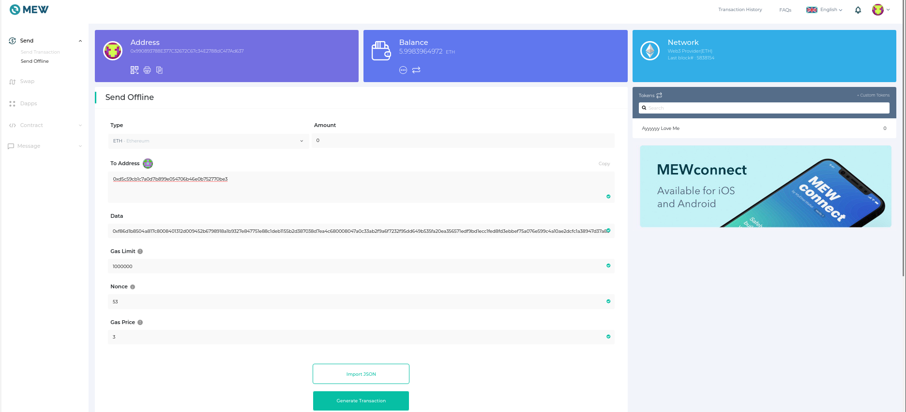
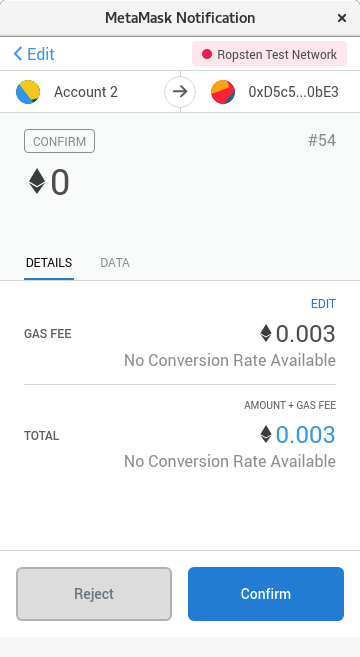
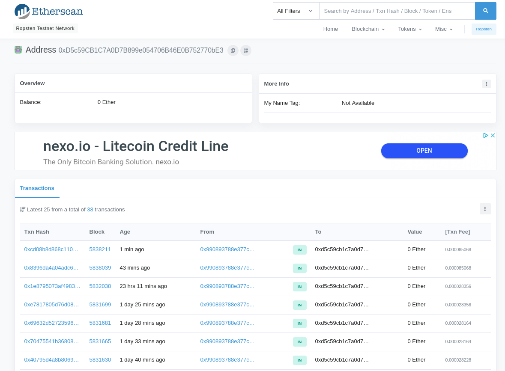

## Motivation
The purpose of yell messages is to provide a mechanism for censorship resistance, in case of an evil accelerator. The intent is to allow other nodes (committee nodes, full nodes) to observe these yell transactions, and if a node determines that the tx was valid, but not put into a ThunderCore block, it can be determined that the accelerator is censoring some transactions.

## Specification:
Yell messages are posted on Ethereum by chain users to a dedicated address. As Ethereum is out of ThunderCore's control, ThunderCore cannot prevent any user from posting yell messages. Yell messages are regular 0-value Ethereum transactions, with an rlp-encoded, signed, fast-path transaction in the payload field. The sender must have enough Ethereum gas to send the message, and the enclosed Thunder tx must be signed by an account having sufficient Thunder gas for the transaction.

The expected use case of yell messages is for situations where the user feels that their transactions submitted to ThunderCore are being ignored. Submitting transactions via yell messages requires Ethereum gas as well as Thunder gas, so is less desirable than submitting transactions directly to ThunderCore. If the user submits the same transaction both directly and via a Yell message, the first received will be accepted (most likely the one sent via ThunderCore due to better scalability) and the second will be rejected due to the duplicate nonce value.

## Forming Yell Messages

### Overview
To create a yell message:
1. Create the ThunderCore transaction that will be sent in the yell message in RLP-encoded form.
2. Then create an Ethereum transaction, specifying the yell target address as the destination address, and use the ThunderCore transaction as the Ethereum transaction's data.

Yells should be sent to the following addresses:

| Thunder Chain | Ethereum Chain | Address |
|---------------|----------------|---------|
| Testnet       | Ropsten        | 0xD5c59CB1C7A0D7B899e054706B46E0B752770bE3|
| Mainnet       | Mainnet        | 0xD5c59CB1C7A0D7B899e054706B46E0B752770bE3|

### Step by step

These step-by-step instructions will use the Thunder Testnet and Ropsten networks.

#### Step 1

In order to test the Thunder Yell, you must first generate a raw Thunder transaction hash. You will supply this hash in the data field of an ETH (or ROP) transaction. See here for one way to accomplish this: https://goethereumbook.org/transaction-raw-create/

Note: You will have to supply the Thunder parameters (account private key, nonce, RPC url, public destination address, TT send amount)
For example, to determine the Thunder nonce:
```
$ curl  -H "Content-Type: application/json" -X POST --data '{"jsonrpc":"2.0","method":"eth_getTransactionCount","params":["0x990893788E377C32672C67c34E2788dC417Ad637", "latest"],"id":1}' https://testnet-rpc.thundercore.com
{"jsonrpc":"2.0","id":1,"result":"0x1c"}
```

The nonce to generate the raw transaction hash is 0x1c, or decimal 28.

#### Step 2

It will also be useful to record the current TT balance of the From and To accounts:

```
$ curl  -H "Content-Type: application/json" -X POST --data '{"jsonrpc":"2.0","method":"eth_getBalance","params":["0x990893788E377C32672C67c34E2788dC417Ad637", "latest"],"id":1}' https://testnet-rpc.thundercore.com
{"jsonrpc":"2.0","id":1,"result":"0xd2770562c72d23e"}
```
```
$ curl  -H "Content-Type: application/json" -X POST --data '{"jsonrpc":"2.0","method":"eth_getBalance","params":["0x52b6798918A1b9327e847751E88C1dEB1155B2d3", "latest"],"id":1}' https://testnet-rpc.thundercore.com
{"jsonrpc":"2.0","id":1,"result":"0xe52668a943fe5c2"}
```

**From Address** Starting balance: 0xd2770562c72d23e, decimal 947849761999999550

**To Address**  Starting balance: 0xe52668a943fe5c2, decimal 1032000010000000450

#### Step 3

Once you have generated your raw transaction hash, navigate to your wallet of choice (which must permit sending a data field). For this example, we will use Metamask and www.myetherewallet.com

#### Step 4

Once you have logged in (for our example we connect myetherwallet to our Metamask wallet), select “Send Offline” from the Left-hand menu.



#### Step 5

Set the “To Address” to be the Slow path Yell Address. For Thunder Testnet this is Ropsten address `0xd5c59cb1c7a0d7b899e054706b46e0b752770be3`

#### Step 6

Copy the raw Thunder transaction hash into the “Data” Field. In our example this is
```
0xf86d1b8504a817c8008401312d009452b6798918a1b9327e847751e88c1deb1155b2d387038d7ea4c680008047a0c33ab2f9a6f7232f95dd649b535fa20ea356571edf9bd1ecc1fed8fd3ebbef75a076e599c4a10ae2dcfc1a38947d37a83158640faa1eeb7edd942ccbbfcf1065ec
```

#### Step 7

Increase the Gas Limit to account for the Data field payload. In the example above we set to 1,000,000.

#### Step 8

If not automatically populated, set the Ropsten nonce (53 above)

#### Step 9

Myetherwallet provides green check marks if all the parameters are valid. Click “Generate Transaction”.
 
#### Step 10

In our example, a new Metamask window opens asking us to Confirm the transaction details. Click “Confirm”.



#### Step 11

Once the transaction is confirmed, check the status in the block explorer (The target Yell address). Our Yell transaction was confirmed below in Ropsten Block 5838211.



#### Step 12

Note: If everything has worked to this point, you should be able to query the Thunder RPC for updated balances:
```
$ curl  -H "Content-Type: application/json" -X POST --data '{"jsonrpc":"2.0","method":"eth_getBalance","params":["0x990893788E377C32672C67c34E2788dC417Ad637", "latest"],"id":1}' https://testnet-rpc.thundercore.com
{"jsonrpc":"2.0","id":1,"result":"0xd2264daa8de123e"}
```
```
$ curl  -H "Content-Type: application/json" -X POST --data '{"jsonrpc":"2.0","method":"eth_getBalance","params":["0x52b6798918A1b9327e847751E88C1dEB1155B2d3", "latest"],"id":1}' https://testnet-rpc.thundercore.com
{"jsonrpc":"2.0","id":1,"result":"0xe55f409390665c2"}
```

**From Address** Ending Balance: 0xd2264daa8de123e, decimal 946429761999999550

**To Address** Ending Balance: 0xe55f409390665c2, decimal 1033000010000000450

#### Step 13

If the Ending Balances are unchanged, then the Thunder Transaction has failed. Check the following:

1. Ensure that enough time has passed for the Slow Chain txn to be confirmed. 
2. Review the information used to generate the transaction hash (nonce, private Key, gasPrice, etc.)
